<p align="center">
  
</p>

<h1 align="center">Tonkatsu Box</h1>

<p align="center">
  <b>Organize your games, movies, TV shows, anime, visual novels, and manga — all in one place</b>
</p>

<p align="center">
  <a href="#"></a>
  <a href="#"></a>
  <a href="#"></a>
</p>

<p align="center">
  <a href="https://github.com/hacan359/tonkatsu_box/actions/workflows/test.yml">
    
  </a>
  <a href="LICENSE">
    
  </a>
  <a href="https://flutter.dev">
    
  </a>
</p>

---

Tonkatsu Box is a free, open-source collection manager for retro games, movies, TV shows, anime, visual novels, and manga. Search IGDB, TMDB, VNDB, and AniList databases with hundreds of thousands of titles, organize them into custom collections, track your backlog and progress, rate everything from 1 to 10, create visual boards with drag-and-drop, import your watch history from Trakt.tv, and share collections with friends. Available for Windows, Linux, and Android in English and Russian.

<p align="center">
  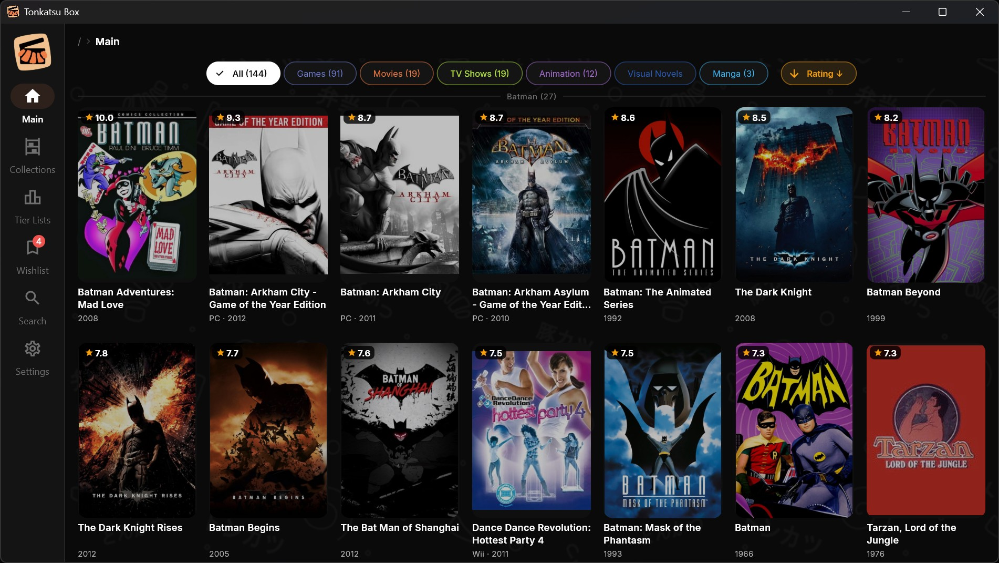
</p>

## What You Can Do

### 🎮 Build Collections
Create as many collections as you want — by platform (SNES, PlayStation, PC), genre (RPGs, Sci-Fi), or your own lists (Backlog, Favorites, Couch co-op night). Mix games, movies, anime, and visual novels in a single collection. Switch between list and poster grid view.

<p align="center">
  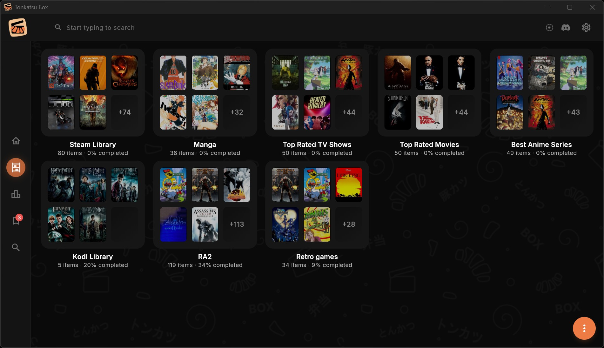
</p>
<p align="center">
  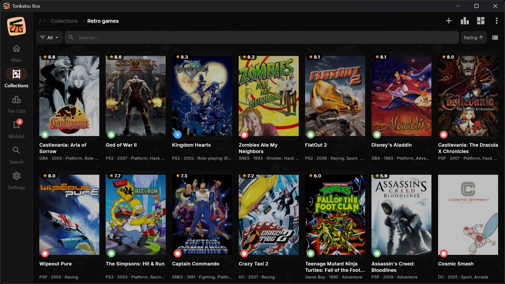
</p>

### 🔍 Search & Discover
Multiple search tabs — **Games**, **TV**, **Visual Novels**, and **Manga** — each with their own filters:

**Games** (powered by IGDB):
- Filter by platform — select one or multiple platforms from a searchable list (NES, SNES, PlayStation, PC, and hundreds more)
- Sort by relevance, release date, or IGDB rating
- Pick the exact platform version when adding a game to your collection

<p align="center">
  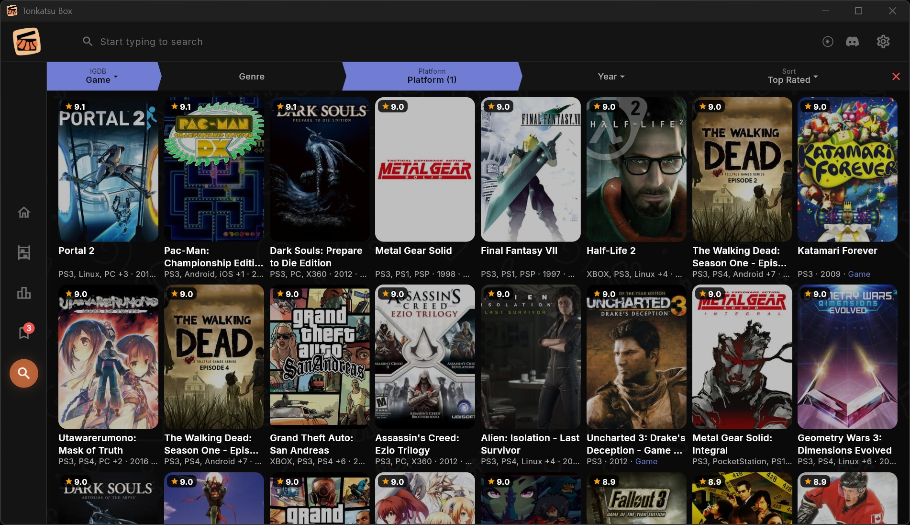
</p>

**Movies, TV Shows & Anime** (powered by TMDB):

<p align="center">
  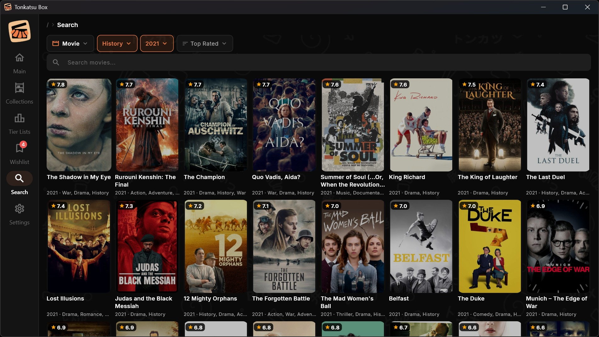
</p>

- Filter by type — All, Movies, TV Shows, or Animation
- Sort by relevance, release date, or rating
- Anime is detected automatically by genre — both animated movies and animated series
- Enable personalized TMDB recommendations in Settings — get tailored suggestions right in the app, browse them and add to your collections

<p align="center">
  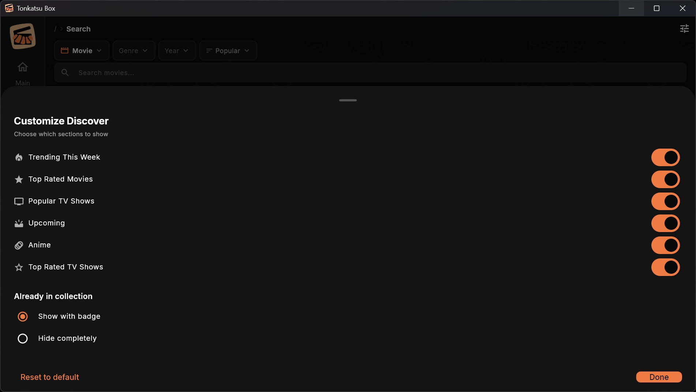
</p>

**Visual Novels** (powered by VNDB):
- Browse by genre/tag or search by title
- Sort by rating, release date, or vote count
- No API key required — VNDB is free and open

**Manga** (powered by AniList):
- Browse by genre, format (manga, manhwa, manhua, light novel)
- Sort by rating, popularity, or newest
- No API key required — AniList is free and open

<p align="center">
  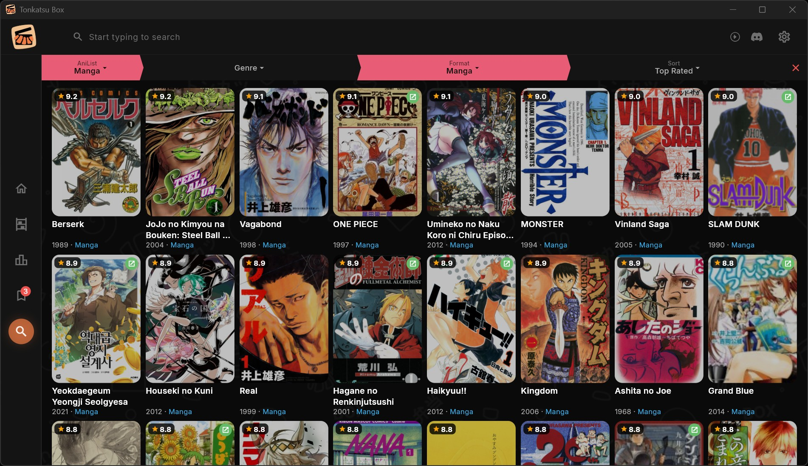
</p>

Results load as you scroll with automatic pagination. Each card shows the poster, title, year, rating, and top genres at a glance.

### 📝 Wishlist
No internet right now? Jot down the name of a game or movie to search for later. Tag it with a media type, add a note, and tap it when you're ready — the app opens search with the name pre-filled. Mark items as resolved when you've found them.

<p align="center">
  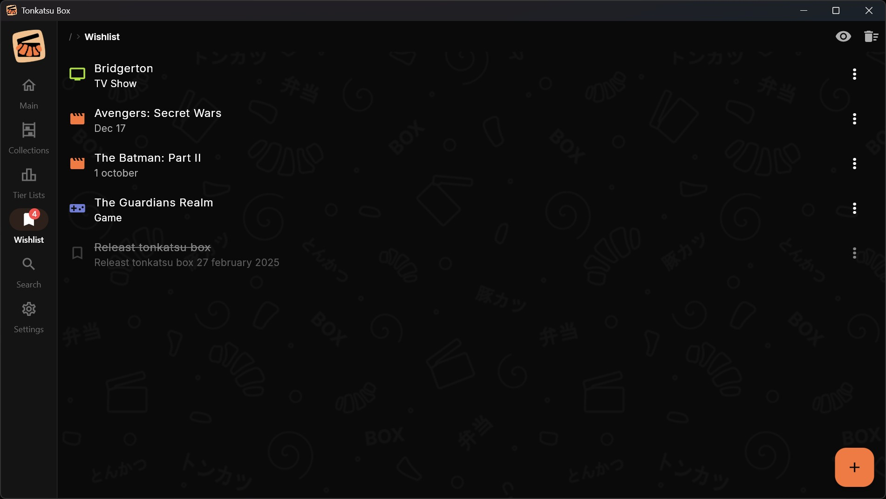
</p>

### 📊 Track Your Progress
Mark items as Not Started, In Progress, Completed, On Hold, or Dropped. For TV shows and anime, track individual episodes with per-season checkboxes. Rate everything from 1 to 10 stars. See when you started and finished each item.

<p align="center">
  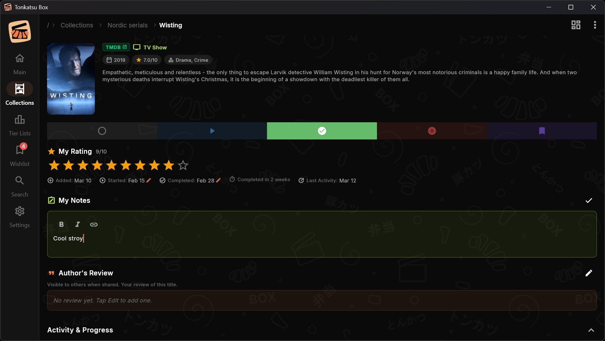
</p>

### 🎨 Visual Boards
Arrange your collection on a free-form board — drag posters around, add text notes, images, and links. Draw connections between items. Browse high-quality game artwork from SteamGridDB and add it to your boards. Each item can also have its own personal board.

<p align="center">
  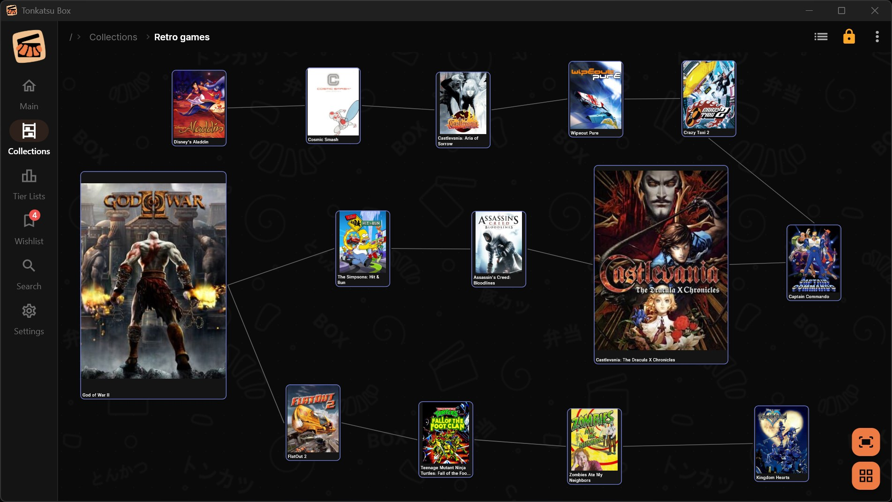
</p>

### 🌐 English & Russian
The entire interface is available in English and Russian with runtime language switching. Switch anytime in **Settings → Language** — all menus, statuses, labels, and messages update instantly without restarting the app.

### 📊 Tier Lists
Create tier lists to rank items from your collections. Drag and drop items into S/A/B/C tiers. Customize tiers — rename, change colors, add or remove. Create a tier list from all items or scope it to a specific collection. Export as a shareable PNG image.

<p align="center">
  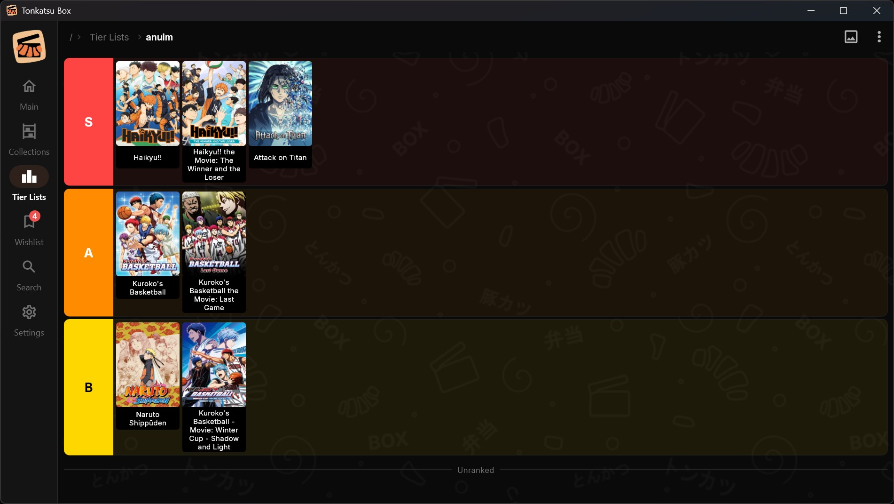
</p>

### 📤 Share with Friends
Export your collections as `.xcoll` (lightweight) or `.xcollx` (full offline copy with all images and data). Friends can import them and fork to create their own version.

## Getting Started

### Step 1: Install and run

```bash
git clone https://github.com/hacan359/tonkatsu_box.git
cd xerabora
flutter pub get
flutter run -d windows    # or: flutter run -d linux / -d android
```

> [!NOTE]
> You'll need [Flutter SDK](https://flutter.dev/docs/get-started/install) installed. Windows builds require the Windows desktop development tools, Android builds require the Android SDK.
>
> Android release builds require a signing keystore. See the [Contributing Guide](docs/CONTRIBUTING.md#android-release-builds) for setup instructions.

### Step 2: Start using the app

The app works out of the box — create collections, import `.xcoll`/`.xcollx` files, manage your wishlist, and organize everything right away. Search for visual novels (VNDB) and manga (AniList) works without any setup.

> [!TIP]
> On first launch, the app will walk you through a **Welcome Wizard** that explains everything — you can also revisit it later from **Settings → Welcome Guide**.

### Step 3: Add your own API keys (optional)

The app comes with built-in API keys, so everything works from the start. For better stability and higher rate limits, you can register your own free keys in **Settings → Credentials**. See the [API Keys Setup](https://github.com/hacan359/tonkatsu_box/wiki/API-Keys-Setup) guide on the Wiki for details.

## Sharing Collections

### Exporting

1. Open a collection → tap the **menu** (⋮) → **Export**
2. Choose a format:
   - **Light export** (`.xcoll`) — small file with just the list of items. The recipient will need internet to load images and details.
   - **Full export** (`.xcollx`) — complete package with all images, board layouts, and media data. Works fully offline.
3. Pick where to save the file

### Importing

1. Go to **Settings** → **Database** → **Import Collection**
2. Select a `.xcoll` or `.xcollx` file
3. The collection appears in your list — you can browse it as read-only or **fork** it to make your own editable copy

### Importing from Trakt.tv

Already tracking movies and TV shows on [Trakt.tv](https://trakt.tv)? Import your data in one step:

1. Export your data at **trakt.tv/users/YOU/data** (you'll get a ZIP file)
2. Go to **Settings** → **Trakt Import** → select the ZIP file
3. Preview your data (watched movies/shows, ratings, watchlist), choose import options, and hit **Start Import**

The importer brings in your watched items (as completed), ratings (1–10), watchlist (as planned), and even individual watched episodes — all matched to TMDB metadata. Animated content is automatically detected and categorized as anime.

### Demo Collections

Want to try the app with pre-built content? Check out [**Tonkatsu Collections**](https://github.com/hacan359/tonkatsu-collections) — the largest open library of ready-to-import retro game databases:

- **25,653 games** across **23 platforms** — from Atari 2600 to PSP, with cover images
- **Top 50** curated collections for 18 platforms (PS1–PS5, NES, SNES, Switch, Xbox, PC...)
- **Movies, TV shows & anime** — top rated from TMDB

Download any `.xcollx` file, import it from **Settings → Import Collection**, and everything works offline immediately — no API keys needed for imported data.

## Platforms

| | Windows | Linux | Android |
|---|:---:|:---:|:---:|
| Collections & search | ✅ | ✅ | ✅ |
| Progress & episode tracking | ✅ | ✅ | ✅ |
| Visual boards | ✅ | ✅ | ✅ |
| VGMaps browser (level maps) | ✅ | — | — |
| Export & import | ✅ | ✅ | ✅ |
| Trakt.tv import | ✅ | ✅ | ✅ |
| Language (EN / RU) | ✅ | ✅ | ✅ |

> **Note:** Linux support is experimental — the build is included in releases but has not been extensively tested yet.

## Documentation

Full documentation is available on the **[Wiki](https://github.com/hacan359/tonkatsu_box/wiki)**.

For developers and contributors, technical docs are in the `docs/` directory:

| Document | Description |
|----------|-------------|
| [Wiki](https://github.com/hacan359/tonkatsu_box/wiki) | User guides, features, how it works |
| [Architecture](docs/ARCHITECTURE.md) | Project structure, models, database |
| [Roadmap](docs/ROADMAP.md) | Development progress and future plans |
| [Export Format](docs/RCOLL_FORMAT.md) | `.xcoll` / `.xcollx` file format spec |
| [Gamepad Support](docs/GAMEPAD.md) | Xbox controller / D-pad navigation |
| [Contributing](docs/CONTRIBUTING.md) | Contribution guidelines |
| [Changelog](CHANGELOG.md) | Version history |

## Tech Stack

Flutter 3.38+ / Dart 3.10+ · Riverpod · SQLite · Dio · Material Design 3 · IGDB · TMDB · VNDB · AniList · SteamGridDB

## Contributing

Contributions are welcome! See the [Contributing Guide](docs/CONTRIBUTING.md) for details.

## Credits

- Movie, TV show, and anime data provided by [TMDB](https://www.themoviedb.org/). This product uses the TMDB API but is not endorsed or certified by TMDB.
- Game data provided by [IGDB](https://www.igdb.com/).
- Visual novel data provided by [VNDB](https://vndb.org/).
- Manga data provided by [AniList](https://anilist.co/).
- Artwork provided by [SteamGridDB](https://www.steamgriddb.com/).

## License

MIT
