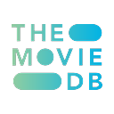
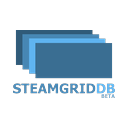
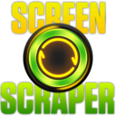

<p align="center">
  
</p>

<h1 align="center">Tonkatsu Box</h1>

<p align="center">
  <b>Your personal collection manager for games, movies, TV shows, anime, visual novels, and manga</b>
</p>

<p align="center">
  <a href="https://github.com/hacan359/tonkatsu_box/releases/latest"></a>
  <a href="https://github.com/hacan359/tonkatsu_box/releases/latest"></a>
  <a href="https://github.com/hacan359/tonkatsu_box/releases/latest"></a>
</p>

<p align="center">
  <a href="https://github.com/hacan359/tonkatsu_box/actions/workflows/test.yml"></a>
  <a href="LICENSE"></a>
  <a href="https://flutter.dev"></a>
  <a href="https://discord.gg/JZVNPF7cS2"></a>
</p>

---

> [!WARNING]
> **This app is in active development.** Updates may include database migrations that change data format. Please **create a backup** before updating (Settings → Backup → Create Backup). Alternatively, you can manually copy the app data folder:
> - **Windows:** `%APPDATA%\Roaming\Tonkatsu Box\Tonkatsu Box`
> - **Linux:** `~/.local/share/tonkatsu_box` (or `$XDG_DATA_HOME/tonkatsu_box`)
> - **Android:** use the built-in backup feature (Settings → Backup)

---

Tonkatsu Box is a free, open-source app to organize your media collections. Search millions of titles from IGDB, TMDB, VNDB, and AniList. Track your progress, rate everything, create visual boards and mood grids, and import your library from Steam, Trakt.tv, RetroAchievements, MyAnimeList, or AniList.

<p align="center">
  
</p>

## Screenshots

| Collections | Collection Grid |
|---|---|
|  |  |

| Bulk Selection | Item Details |
|---|---|
|  |  |

| Game Search | Add to Collection |
|---|---|
|  |  |

| Settings | Search Sources |
|---|---|
|  |  |

| Tier List | Mood Grid |
|---|---|
|  |  |

## Features

| | |
|---|---|
| **Collections** | Organize by platform, genre, or any way you like. Grid, list, and table views |
| **Wishlist** | Dedicated top-level list for what you want to play, watch, or read next |
| **Search** | IGDB (games), TMDB (movies/TV), AniList (anime & manga), VNDB (visual novels) |
| **Progress Tracking** | Status, ratings 1-10, episode tracking for TV shows and anime |
| **Discord Rich Presence** | Show what you're playing/watching/reading in Discord (desktop) |
| **Visual Boards** | Drag-and-drop canvas with posters, notes, and connections |
| **Tier Lists & Mood Grids** | Rank items into S/A/B/C tiers, or arrange them on a visual N×M board with labels — export either as PNG |
| **Import** | Steam library, Trakt.tv history, RetroAchievements progress, MyAnimeList XML, AniList by username |
| **Kodi Sync** | Push movies, TV shows, and anime to a Kodi media server over JSON-RPC |
| **Export & Share** | .xcoll / .xcollx files with full offline support |
| **Gamepad** | Navigate with Xbox controller (desktop and Android handhelds) |
| **Languages** | English & Russian |

## Download

| Platform | Link |
|----------|------|
| Windows | [**Download .exe**](https://github.com/hacan359/tonkatsu_box/releases/latest) |
| Linux | [**Download .AppImage**](https://github.com/hacan359/tonkatsu_box/releases/latest) |
| Android | [**Download .apk**](https://github.com/hacan359/tonkatsu_box/releases/latest) |

> Linux support is experimental.

## Quick Start

1. **Download and install** from the links above
2. **Launch the app** — Welcome Wizard guides you through setup
3. **Start adding items** from Search, or import ready-made collections

The app works offline after setup. API keys are built-in.

> [Full guide on Wiki](https://github.com/hacan359/tonkatsu_box/wiki/Getting-Started)

## Ready-made Collections

**[Tonkatsu Collections](https://github.com/hacan359/tonkatsu-collections)** — 25,000+ games across 23 platforms, top movies, TV shows & anime. Download `.xcollx` → Import → Done.

## Import Your Data

Already tracking elsewhere? Bring your data:

| | Source | What's imported |
|:-:|--------|-----------------|
|  | **Steam** | Owned games, playtime, last played date |
|  | **Trakt.tv** | Watch history, ratings, watchlist, episode progress |
|  | **RetroAchievements** | Retro game library, achievement progress, awards |
|  | **MyAnimeList** | Anime and manga lists with scores, status and progress from an XML export |
|  | **AniList** | Anime and manga directly by a public username — no API key required |
| 📦 | **.xcollx files** | Collections shared by others |

> [Import guides on Wiki](https://github.com/hacan359/tonkatsu_box/wiki)

## Data Sources

| | Type | Source | API Key |
|:-:|------|--------|---------|
|  | Games | [IGDB](https://www.igdb.com/) | Built-in |
|  | Movies & TV | [TMDB](https://www.themoviedb.org/) | Built-in |
|  | Visual Novels | [VNDB](https://vndb.org/) | Not required |
|  | Anime & Manga | [AniList](https://anilist.co/) | Not required |
|  | Artwork | [SteamGridDB](https://www.steamgriddb.com/) | Built-in |
|  | Retro media gallery | [ScreenScraper](https://www.screenscraper.fr/) | Required (user account) |
|  | Achievements | [RetroAchievements](https://retroachievements.org/) | Required |

> [API Keys Setup](https://github.com/hacan359/tonkatsu_box/wiki/API-Keys-Setup)

## Platform Support

| Feature | Windows | Linux | Android |
|---------|:-------:|:-----:|:-------:|
| Collections & search | ✅ | ✅ | ✅ |
| Progress tracking | ✅ | ✅ | ✅ |
| Visual boards | ✅ | ✅ | ✅ |
| Tier lists | ✅ | ✅ | ✅ |
| Import (Steam/Trakt/RA) | ✅ | ✅ | ✅ |
| Kodi sync | ✅ | ✅ | ✅ |
| VGMaps browser | ✅ | — | — |
| Gamepad | ✅ | ✅ | ✅ |
| Discord Rich Presence | ✅ | ✅ | — |

## Documentation

- [**Wiki**](https://github.com/hacan359/tonkatsu_box/wiki) — user guides & FAQ
- [**Changelog**](CHANGELOG.md) — version history

## Building from Source

```bash
git clone https://github.com/hacan359/tonkatsu_box.git
cd tonkatsu_box
flutter pub get
flutter run -d windows  # or linux / android
```

Requires Flutter 3.38+. See [CONTRIBUTING.md](docs/CONTRIBUTING.md) for details.

## Community

- [Discord](https://discord.gg/JZVNPF7cS2) — chat & support
- [Issues](https://github.com/hacan359/tonkatsu_box/issues) — bug reports

## Contributing

Contributions welcome! See [CONTRIBUTING.md](docs/CONTRIBUTING.md) for build instructions, code style, and PR guidelines.

## Credits

Data: [IGDB](https://www.igdb.com/) · [TMDB](https://www.themoviedb.org/) · [VNDB](https://vndb.org/) · [AniList](https://anilist.co/) · [MyAnimeList](https://myanimelist.net/) · [RetroAchievements](https://retroachievements.org/) · [SteamGridDB](https://www.steamgriddb.com/) · [ScreenScraper](https://www.screenscraper.fr/)

*This product uses the TMDB API but is not endorsed or certified by TMDB.*

## License

[MIT](LICENSE)
