<p align="center">
  
</p>

<h1 align="center">Tonkatsu Box</h1>

<p align="center">
  <b>Your personal collection manager for games, movies, TV shows, anime, visual novels, manga, books, music and podcasts</b>
</p>

<p align="center">
  <a href="https://github.com/hacan359/tonkatsu_box/releases/latest"></a>
  <a href="https://github.com/hacan359/tonkatsu_box/releases/latest"></a>
    <a href="https://github.com/hacan359/tonkatsu_box/releases/latest"></a>
  <a href="https://github.com/hacan359/tonkatsu_box/releases/latest"></a>
  <a href="https://www.rustore.ru/catalog/app/com.hacan359.tonkatsubox?utm_source=available_in_rustore&utm_medium=com.hacan359.tonkatsubox&rsm=1&mt_link_id=iios36&mt_sub1=com.hacan359.tonkatsubox"></a>
</p>

<p align="center">
  <a href="https://github.com/hacan359/tonkatsu_box/actions/workflows/test.yml"></a>
  <a href="https://github.com/hacan359/tonkatsu_box/actions/workflows/test.yml"></a>
  <a href="LICENSE"></a>
  <a href="https://flutter.dev"></a>
  <a href="https://discord.gg/JZVNPF7cS2"></a>
</p>

---

> [!WARNING]
> **This app is in active development.** Updates may include database migrations that change data format. Please **create a backup** before updating (Settings → Backup → Create Backup). Alternatively, you can manually copy the app data folder:
> - **Windows:** `%APPDATA%\Roaming\Tonkatsu Box\Tonkatsu Box`
> - **Linux:** `~/.local/share/tonkatsu_box` (or `$XDG_DATA_HOME/tonkatsu_box`)
> - **macOS:** `~/Library/Application Support/com.hacan359.tonkatsuBox`
> - **Android:** use the built-in backup feature (Settings → Backup)

---

Tonkatsu Box is a free, open-source app to organize your media collections. Search millions of titles across fifteen catalogs, track your progress episode by episode, rate everything, see your library in numbers, build visual boards, tier lists and mood grids, and bring in what you already track elsewhere.

### Search fifteen catalogs

| | | | | | | |
|:-:|:-:|:-:|:-:|:-:|:-:|:-:|
| <br>IGDB | <br>TMDB | 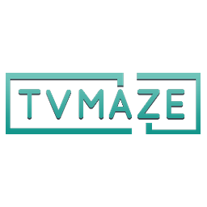<br>TVmaze | <br>VNDB | <br>AniList | <br>Kitsu | <br>MangaBaka |
| 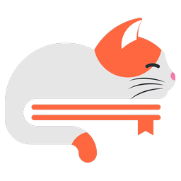<br>MangaDex | <br>OpenLibrary | <br>Fantlab | <br>Google&nbsp;Books | <br>Hardcover | <br>ComicVine | 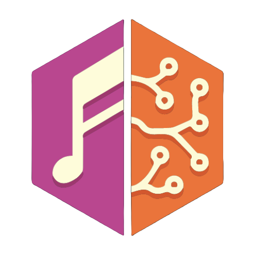<br>MusicBrainz |
| <br>Podcast&nbsp;Index | | | | | | |

### Bring your library from

| | | | | | |
|:-:|:-:|:-:|:-:|:-:|:-:|
| <br>Steam | <br>IGDB&nbsp;list | <br>Trakt.tv | <br>Simkl | <br>Kinorium | <br>RetroAch. |
| <br>MyAnimeList | <br>AniList | <br>Hardcover | 📁<br>JSON&nbsp;/&nbsp;CSV | 📦<br>.xcollx | |

<p align="center">
  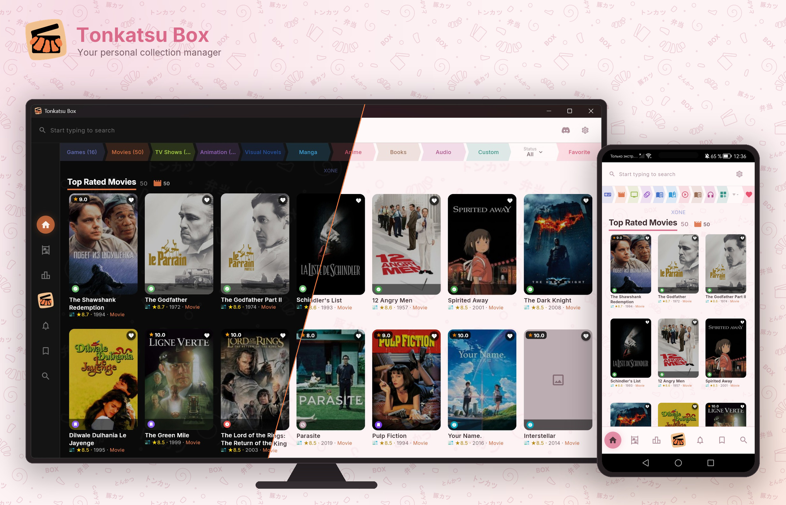
</p>

## Contents

[Languages](#languages) · [Screenshots](#screenshots) · [Features](#features) · [Download](#download) · [Quick Start](#quick-start) · [Ready-made Collections](#ready-made-collections) · [Import Your Data](#import-your-data) · [Sync & Backup](#sync--backup) · [Data Sources](#data-sources) · [Platform Support](#platform-support) · [Self-Hosting](#self-hosting-web) · [Building from Source](#building-from-source) · [Contributing](#contributing)

## Languages

The whole interface is localized with runtime switching. Pick your language in **Settings → App Language**, no restart needed.

| | Language | Status |
|:-:|---|:-:|
| 🇬🇧 | English | ✅ Complete |
| 🇷🇺 | Русский (Russian) | ✅ Complete |
| 🇨🇳 | 简体中文 (Simplified Chinese) | ✅ Complete |
| 🇪🇸 | Español (Spanish) | ✅ Complete |
| 🇧🇷 | Português (Brazilian Portuguese) | ✅ Complete |
| 🇫🇷 | Français (French) | ✅ Complete |

## Screenshots

| Home | Collections |
|---|---|
| 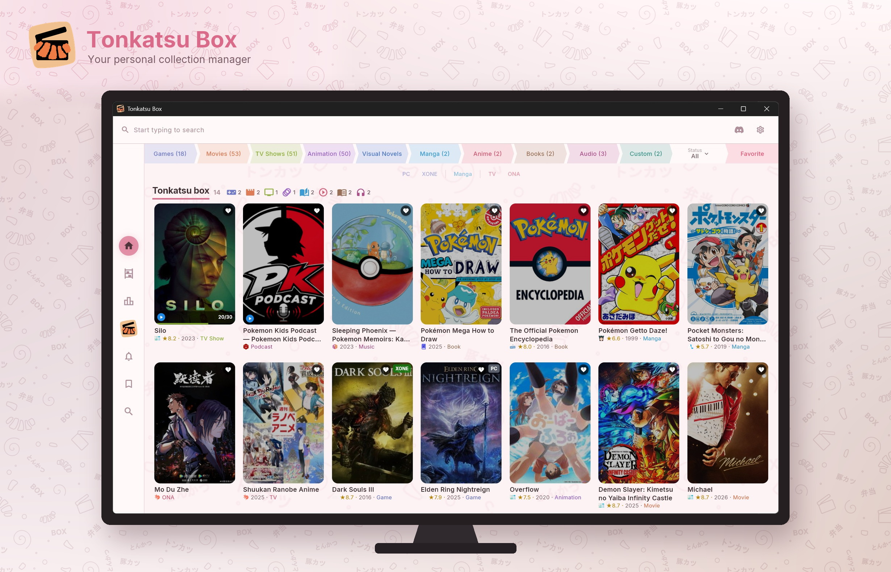 | 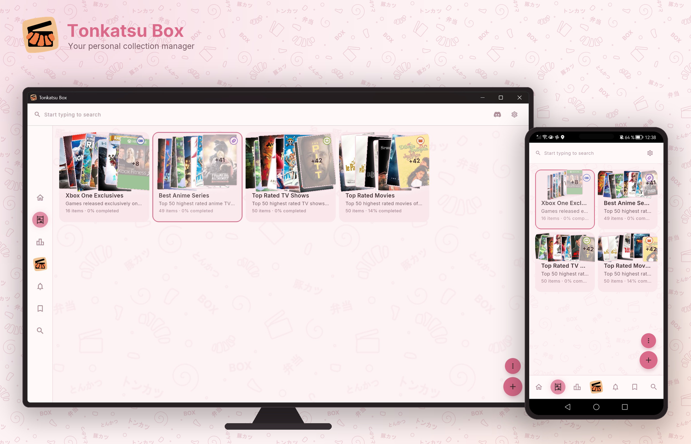 |

| Search | Title Preview |
|---|---|
| 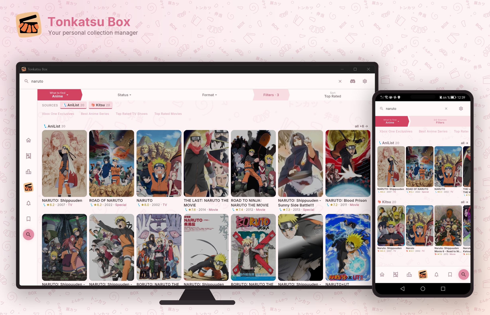 | 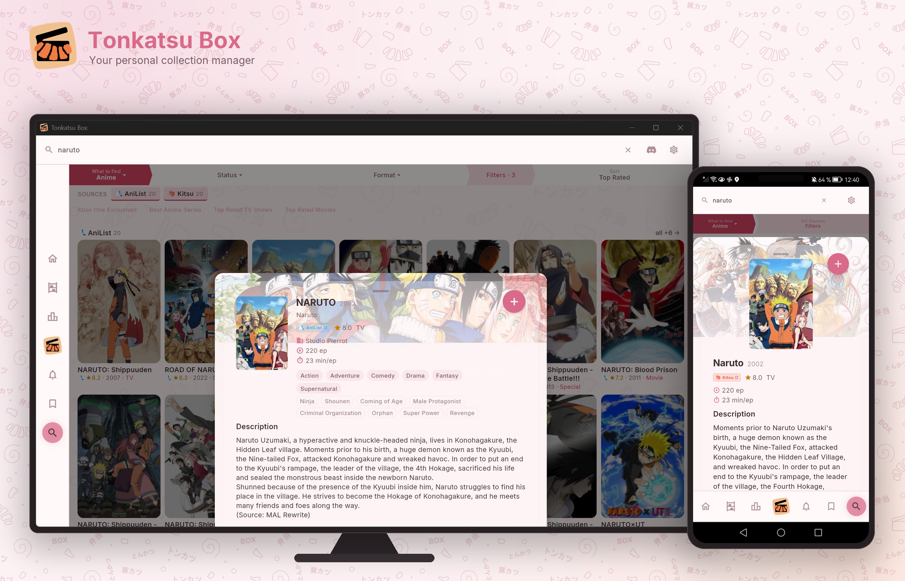 |

| Item Details | Filters |
|---|---|
| 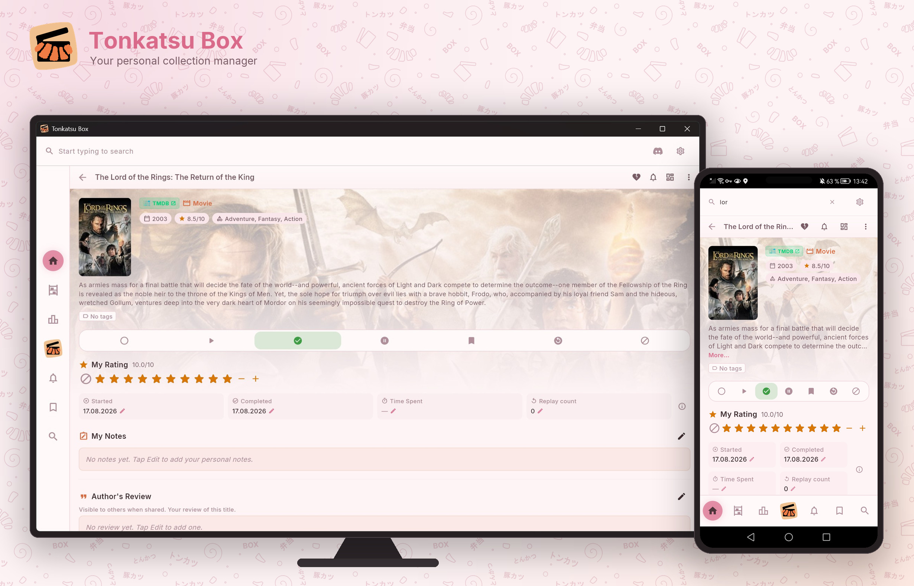 | 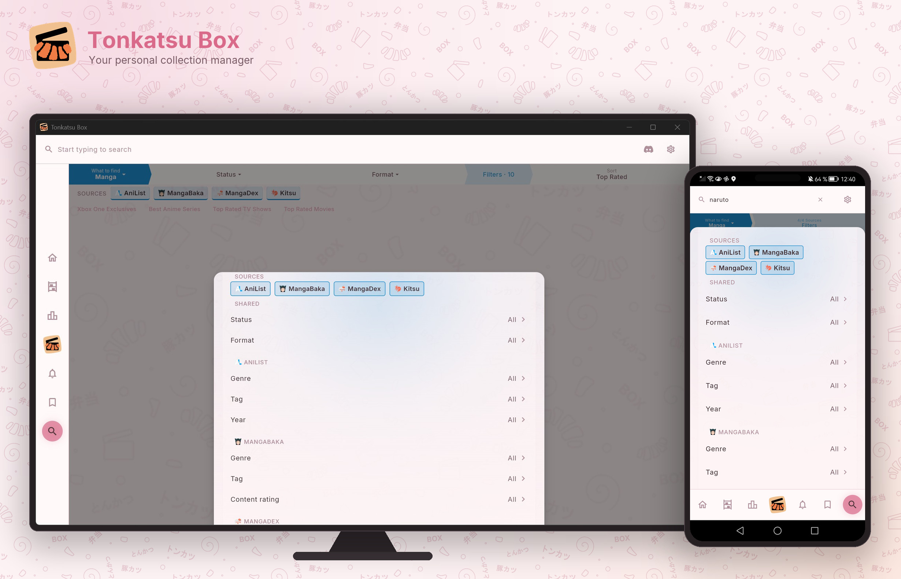 |

| Episode Tracker | Tier List |
|---|---|
| 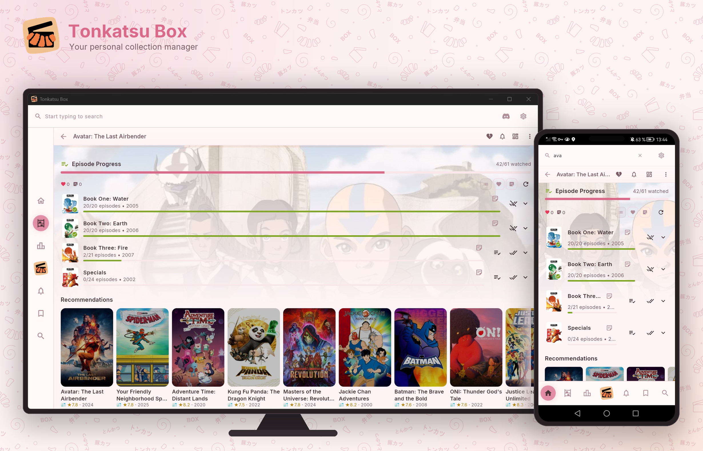 | 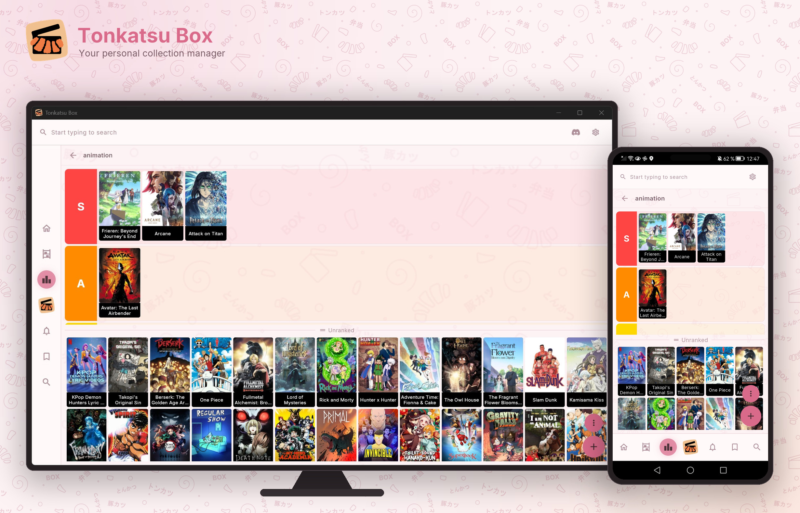 |

| Genre Cloud | Import |
|---|---|
| 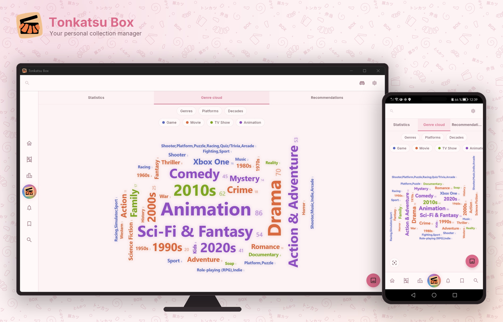 | 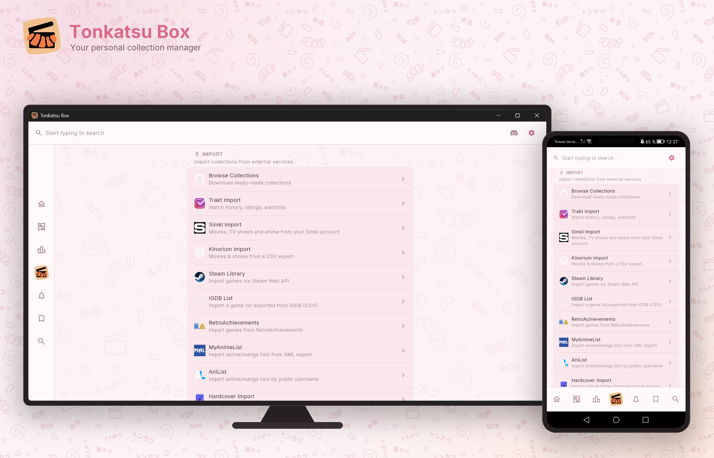 |

## Features

| | | |
|:-:|---|---|
| 📦 | **Collections** | Organize by platform, genre, or any way you like. Grid, list, table and board views, manual drag-and-drop order, bulk actions over a selection |
| 🔍 | **Search** | Fifteen catalogs behind one search field, each with its own filters and an empty-query browse mode. Add a result to several collections at once |
| ✅ | **Progress tracking** | Status, ratings 1-10, start and finish dates, replays, time spent. Reading progress by page for books, chapters for manga, a listened-track checklist for albums |
| 📺 | **Episode tracker** | Season accordion with posters, episode stills, air dates and synopses. Mark an episode, a whole season, or the next unwatched one in a tap. TMDB, TVmaze and Kitsu titles |
| ❤️ | **Likes & notes** | Like and annotate a single episode, season, chapter, volume or page, and filter the list down to what you starred |
| 🏷️ | **Tags** | Global tags with their own manager, grouping and filtering — add or remove them across a whole selection |
| 📊 | **Statistics** | Your library in numbers, for all time or one year: counters, per-type breakdowns, a month-by-month ribbon, platforms, formats, tags, best vs worst, and a shareable summary card |
| ☁️ | **Personalization** | A genre / platform / decade cloud built from your library, and recommendations from what you completed and rated |
| 🔔 | **Releases & calendar** | Follow a show and its upcoming episodes land on a month / week / day calendar, together with any date you add yourself |
| 📝 | **Wishlist** | Dedicated top-level list for what you want to play, watch, or read next — importers park anything they could not match here |
| 🎨 | **Visual boards** | Drag-and-drop canvas with posters, notes, and connections |
| 🏆 | **Tier lists & mood grids** | Rank items into S/A/B/C tiers, or arrange them on a visual N×M board with labels — export either as PNG |
| 📥 | **Import** | Simkl, Steam, IGDB list CSV, Trakt.tv, Kinorium CSV, RetroAchievements, MyAnimeList XML, AniList and Hardcover by username, plus your own cards from JSON / CSV |
| 🎬 | **Kodi sync** | Pull watched status and ratings for your movies from a Kodi media server over JSON-RPC |
| 🎧 | **Discord Rich Presence** | Show what you're playing/watching/reading in Discord (desktop) |
| 👤 | **Profiles** | Several people on one install — separate collections, boards and covers per profile, with the API keys and app language shared |
| 💾 | **Export & share** | .xcoll / .xcollx files with full offline support, device-to-device sync, one-click backups |
| 🎮 | **Gamepad** | Navigate with Xbox controller (desktop and Android handhelds) |

## Download

| Platform | Link |
|----------|------|
| Windows | [**Download .zip**](https://github.com/hacan359/tonkatsu_box/releases/latest) |
| Linux | [**Download .tar.gz**](https://github.com/hacan359/tonkatsu_box/releases/latest) |
| macOS | [**Download .dmg**](https://github.com/hacan359/tonkatsu_box/releases/latest) |
| Android | [**Download .apk**](https://github.com/hacan359/tonkatsu_box/releases/latest) or [**RuStore**](https://www.rustore.ru/catalog/app/com.hacan359.tonkatsubox) |

> Linux and macOS support is experimental. The macOS build has not been tested by the maintainers yet, so expect rough edges. It is also unsigned, so macOS will warn about an unidentified developer on first launch.

> On Android you have three options: grab the APK from Releases, install from [RuStore](https://www.rustore.ru/catalog/app/com.hacan359.tonkatsubox), or set up Obtainium for auto-updates (below). RuStore handles updates for you through its own store.

### Auto-updates on Android (Obtainium)

[Obtainium](https://github.com/ImranR98/Obtainium) checks GitHub Releases and installs new APKs for you, so you don't have to download updates by hand.

1. Install Obtainium.
2. Tap **Add App** and paste this into **App source URL**:
   ```
   https://github.com/hacan359/tonkatsu_box
   ```
3. Tap **Add**.
4. The first time it updates, Android asks you to allow installs from Obtainium. Allow it once.
5. In the app settings, pick how often Obtainium checks for releases and turn on auto-update, or just refresh manually whenever you want.

When a new release ships, Obtainium downloads the APK and shows the system install dialog to confirm. Silent background installs are not possible on Android without root.

## Quick Start

1. **Download and install** from the links above
2. **Launch the app** — Welcome Wizard guides you through setup
3. **Start adding items** from Search, or import ready-made collections

The app works offline after setup. API keys are built-in.

> [Full guide on Wiki](https://github.com/hacan359/tonkatsu_box/wiki/Getting-Started)

## Ready-made Collections

**[Tonkatsu Collections](https://github.com/hacan359/tonkatsu-collections)** — 25,000+ games across 23 platforms, top movies, TV shows & anime. Download `.xcollx` → Import → Done.

## Import Your Data

Already tracking elsewhere? Bring your data:

| | Source | What's imported |
|:-:|--------|-----------------|
|  | **Steam** | Owned games, playtime, last played date |
|  | **IGDB** | A game list exported as CSV — matched by IGDB id, with a status you pick for the list |
|  | **Trakt.tv** | Watch history, ratings, watchlist, episode progress |
|  | **Simkl** | Movies, TV shows and anime from one account, signed in with a short code — statuses, ratings, notes and the episode watch history with its original dates |
|  | **Kinorium** | Movies, TV & animation from a CSV export — ratings and watch dates |
|  | **RetroAchievements** | Retro game library, achievement progress, awards |
|  | **MyAnimeList** | Anime and manga lists with scores, status and progress from an XML export |
|  | **AniList** | Anime and manga directly by a public username — no API key required |
|  | **Hardcover** | Book library by username — statuses, ratings, dates and re-reads |
| 📁 | **Your own cards** | A JSON or CSV file of custom entries — titles, types, covers, notes, tags and personal fields |
| 📦 | **.xcollx files** | Collections shared by others |

> [Import guides on Wiki](https://github.com/hacan359/tonkatsu_box/wiki)

## Sync & Backup

Everything lives on your device. Nothing here needs an account or a cloud.

| | What | Where |
|:-:|---|---|
| 🔄 | **Device-to-device sync** — copy the whole database to another device over your home network | Settings → Database → Device-to-device sync |
| 💾 | **Backup & restore** — one archive with collections, tags, boards, tier lists, mood grids, wishlist, watch progress, calendar and settings | Settings → Backup |
| 📁 | **Custom data folder** — keep the database on an SD card or any folder you pick | Settings → Database → Storage location |
|  | **Kodi sync** — pull watched status and ratings for your movies from a Kodi media server | Settings → Kodi |
|  | **Discord Rich Presence** — show what you're playing, watching or reading | Settings → Discord |

> [Details on the Wiki](https://github.com/hacan359/tonkatsu_box/wiki/Data-Sync-Backup)

### Device-to-Device Sync

Move your whole collection from one device to another over your home network. No cloud, no account: the two devices talk to each other directly.

How it works:

1. Open **Settings → Database → Device-to-device sync** on both devices. While the screen is open, each device announces itself on the local network and finds the other one.
2. On the device that should **receive** the data, tap the other device in the list.
3. Confirm on both sides: the receiving device shows what it is about to download (device name, date, collection and item counts), and the sending device asks you to allow the transfer.
4. The full database is copied over and **replaces** everything on the receiving device. Restart the app when asked.

This is a full replace, not a merge. Changes made on the receiving device that the sender doesn't have are gone after the transfer.

Before replacing anything, the app keeps the previous database as a backup. **Settings → Database → Backup → Restore** swaps the current database with that backup, and restoring again swaps them back.

> [!CAUTION]
> **This feature can destroy data. Read this before using it.**
> - Receiving a snapshot **overwrites your entire local database**. Anything you added on this device and nowhere else is lost.
> - There is only **one backup slot**. Receiving a second snapshot overwrites the backup made before the first one — after that, the original data is gone for good.
> - The transfer is **not encrypted** and there is no pairing between devices. Use it only on a network you trust (your home Wi-Fi), never on public or shared networks.
> - If the app is killed or the device loses power in the middle of a transfer or restore, the database can end up corrupted. Keep a regular backup (Settings → Backup) before syncing.

### Custom Data Folder

By default the database lives in the app's private folder. **Settings → Database → Storage location** lets you move it to any folder you pick — for example an SD card or a folder synced by a cloud client.

When you pick an empty folder, the app copies your current data there. When you pick a folder that already holds Tonkatsu Box data, the app switches to that data instead. Either way a restart is required. If the custom folder is missing on startup (unplugged drive, dead network share), the app falls back to the default location instead of failing — Settings shows a warning when that happens.

> [!CAUTION]
> - Pointing two devices or a cloud client at the **same live folder** is not supported and can corrupt the database. Sync clients copy files while they are being written; SQLite does not survive that.
> - When the custom folder is unavailable, the app silently runs on the default (possibly empty) data. Your collection is not lost — plug the drive back in and restart — but anything you add meanwhile lands in the default folder, not the custom one.
> - On Android this feature needs the "All files access" permission, which the app requests only when you actually pick a folder.

## Data Sources

| | Type | Source | API Key |
|:-:|------|--------|---------|
|  | Games | [IGDB](https://www.igdb.com/) | Built-in |
|  | Movies & TV | [TMDB](https://www.themoviedb.org/) | Built-in |
|  | TV Shows | [TVmaze](https://www.tvmaze.com/) | Not required |
|  | Visual Novels | [VNDB](https://vndb.org/) | Not required |
|  | Anime & Manga | [AniList](https://anilist.co/) | Not required |
|  | Manga | [MangaBaka](https://mangabaka.org/) | Not required |
|  | Manga | [MangaDex](https://mangadex.org/) | Not required |
|  | Anime & Manga | [Kitsu](https://kitsu.io/) | Not required |
|  | Books | [OpenLibrary](https://openlibrary.org/) | Not required |
|  | Books | [Fantlab](https://fantlab.ru/) | Not required |
|  | Books | [Google Books](https://books.google.com/) | Optional (free key) |
|  | Books | [Hardcover](https://hardcover.app/) | Required (free token) |
|  | Comics | [ComicVine](https://comicvine.gamespot.com/) | Required (free key) |
|  | Music | [MusicBrainz](https://musicbrainz.org/) | Not required |
|  | Podcasts | [Podcast Index](https://podcastindex.org/) | Built-in |
|  | Artwork | [SteamGridDB](https://www.steamgriddb.com/) | Built-in |
| 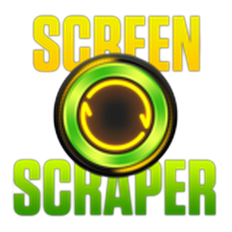 | Retro media gallery | [ScreenScraper](https://www.screenscraper.fr/) | Required (user account) |
|  | Achievements | [RetroAchievements](https://retroachievements.org/) | Required |

> [API Keys Setup](https://github.com/hacan359/tonkatsu_box/wiki/API-Keys-Setup)

## Platform Support

| Feature | Windows | Linux | macOS | Android |
|---------|:-------:|:-----:|:-----:|:-------:|
| Collections & search | ✅ | ✅ | ✅ | ✅ |
| Progress & episode tracker | ✅ | ✅ | ✅ | ✅ |
| Statistics & personalization | ✅ | ✅ | ✅ | ✅ |
| Visual boards | ✅ | ✅ | ✅ | ✅ |
| Tier lists & mood grids | ✅ | ✅ | ✅ | ✅ |
| Imports (Simkl / Steam / Trakt / RA / …) | ✅ | ✅ | ✅ | ✅ |
| Device-to-device sync & backups | ✅ | ✅ | ✅ | ✅ |
| Kodi sync | ✅ | ✅ | ✅ | ✅ |
| VGMaps browser | ✅ | — | — | — |
| Gamepad | ✅ | ✅ | ✅ | ✅ |
| Discord Rich Presence | ✅ | ✅ | ✅ | — |

## Self-Hosting (Web)

Run Tonkatsu Box as a web app on your own machine or home server. One Docker
container serves the app in the browser and keeps the database on the server,
so every device on your network works with the same library.

### Requirements

- Docker with Docker Compose

### Install and run

```bash
git clone https://github.com/hacan359/tonkatsu_box.git
cd tonkatsu_box
docker compose up -d --build
```

The first build takes several minutes (it compiles the web app inside Docker —
no Flutter needed on your machine). Then open:

```
http://<server-ip>:8080
```

### Configuration (optional)

Copy `.env.example` to `.env` next to `docker-compose.yml` and uncomment what
you need. Without a `.env` everything uses defaults.

| Variable | Default | What it does |
|----------|---------|--------------|
| `TONKATSU_DATA_PATH` | `./data` | Host folder with all server data |
| `TONKATSU_PORT` | `8080` | Port the web UI answers on |
| `PUID` / `PGID` | `1000` / `1000` | Owner of the files in the data folder |
| `TONKATSU_KEY_*` | — | API keys (e.g. `TONKATSU_KEY_TMDB`) |

API keys can also be entered in the app itself (**Settings → API Keys**) —
they are stored on the server in `data/keys.json`. Keys set via `.env`
override `keys.json`.

### Files

| Path | What |
|------|------|
| `.env` | Your local configuration (not committed) |
| `data/tonkatsu_box.db` | The database |
| `data/keys.json` | API keys entered in the app |
| `data/images/` | Cover cache |
| `data/snapshots/` | Automatic DB snapshots taken before migrations |

### Backup

Copy the `data/` folder while the container is stopped — that is the whole
backup. There is also **Settings → Backup** in the web UI, which downloads a
portable archive to whatever device you are browsing from.

### Update

```bash
git pull
docker compose up -d --build
```

Pending database migrations run on start; a snapshot of the old database is
saved to `data/snapshots/` first.

### HTTPS and a custom domain (optional)

Caddy in front gives `https://tonkatsu.box`, HTTP/2 and PWA install support:

```bash
# .env: TONKATSU_DOMAIN=tonkatsu.box (default), keep TONKATSU_PORT at 8080
docker compose -f docker-compose.yml -f docker-compose.caddy.yml up -d
```

1. Point the domain at the server: an entry in the router's DNS, or in
   `hosts` (`<server-ip> tonkatsu.box`) on each device.
2. Trust Caddy's local root certificate once per device — the file is
   `data/caddy/caddy/pki/authorities/local/root.crt` (on Windows:
   double-click → Install Certificate → Trusted Root Certification
   Authorities).

Plain HTTP keeps working without any of this — Caddy is an add-on, not a
requirement.

### Notes

- The web build has no accounts or passwords — expose it to your LAN only.
- Desktop-only features (VGMaps, Discord Rich Presence, Kodi, gamepad, LAN
  sync) are hidden in the browser.

## Documentation

- [**Wiki**](https://github.com/hacan359/tonkatsu_box/wiki) — user guides & FAQ
- [**Changelog**](CHANGELOG.md) — version history

## Building from Source

```bash
git clone https://github.com/hacan359/tonkatsu_box.git
cd tonkatsu_box
flutter pub get
flutter run -d windows  # or linux / macos / android
```

Requires Flutter 3.38+ / Dart 3.10+. See [CONTRIBUTING.md](docs/CONTRIBUTING.md) for details.

## Community

- [Discord](https://discord.gg/JZVNPF7cS2) — chat & support
- [Issues](https://github.com/hacan359/tonkatsu_box/issues) — bug reports

## Contributing

Contributions welcome! See [CONTRIBUTING.md](docs/CONTRIBUTING.md) for build instructions, code style, and PR guidelines.

## Credits

Catalogs: [IGDB](https://www.igdb.com/) · [TMDB](https://www.themoviedb.org/) · [TVmaze](https://www.tvmaze.com/) · [VNDB](https://vndb.org/) · [AniList](https://anilist.co/) · [MangaBaka](https://mangabaka.org/) · [MangaDex](https://mangadex.org/) · [Kitsu](https://kitsu.io/) · [OpenLibrary](https://openlibrary.org/) · [Fantlab](https://fantlab.ru/) · [Google Books](https://books.google.com/) · [Hardcover](https://hardcover.app/) · [ComicVine](https://comicvine.gamespot.com/) · [MusicBrainz](https://musicbrainz.org/) · [Cover Art Archive](https://coverartarchive.org/) · [ListenBrainz](https://listenbrainz.org/) · [Podcast Index](https://podcastindex.org/)

Imports and extras: [Simkl](https://simkl.com/) · [Trakt.tv](https://trakt.tv/) · [Steam](https://store.steampowered.com/) · [Kinorium](https://kinorium.com/) · [MyAnimeList](https://myanimelist.net/) · [RetroAchievements](https://retroachievements.org/) · [SteamGridDB](https://www.steamgriddb.com/) · [ScreenScraper](https://www.screenscraper.fr/) · [Kodi](https://kodi.tv/)

*This product uses the TMDB API but is not endorsed or certified by TMDB.*

## License

[MIT](LICENSE)
