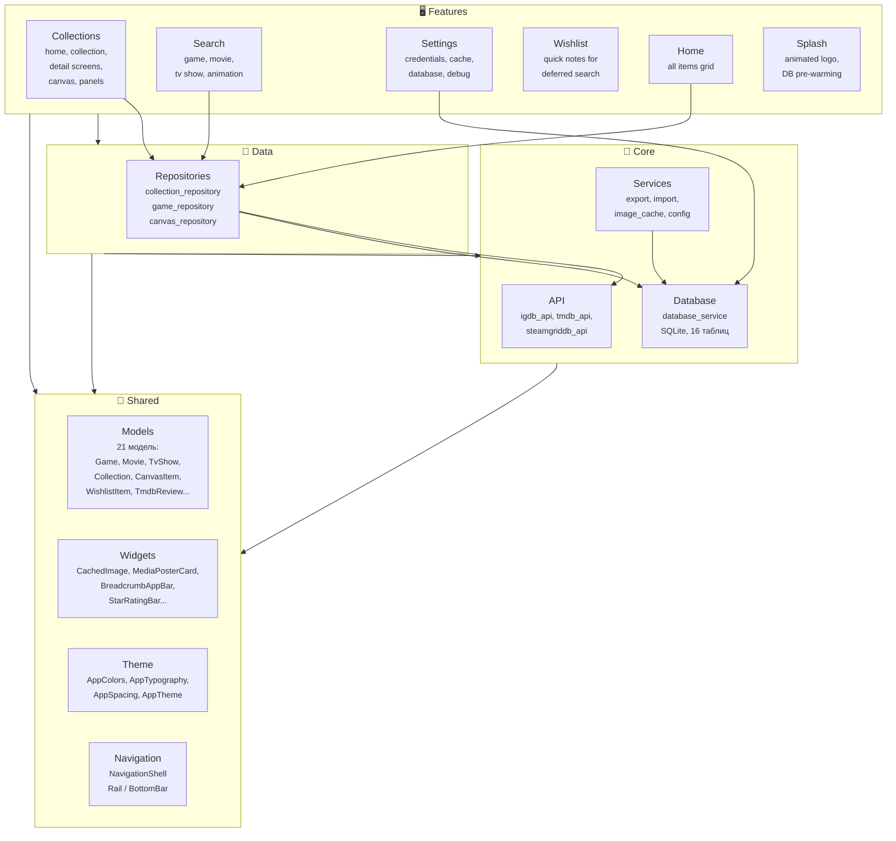
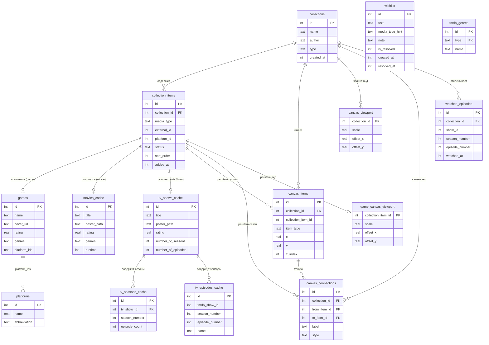

[← Back to README](../README.md)

# Архитектура Tonkatsu Box

## Обзор

Tonkatsu Box — кроссплатформенное приложение на Flutter для управления коллекциями ретро-игр, фильмов и сериалов с интеграцией IGDB, TMDB и SteamGridDB API.

| Слой | Технология |
|------|------------|
| UI | Flutter (Material 3) |
| State | Riverpod |
| Database | SQLite (sqflite_ffi на desktop, sqflite на Android) |
| API | IGDB (Twitch OAuth), TMDB (Bearer token), SteamGridDB (Bearer token) |
| Platform | Windows Desktop, Linux Desktop, Android (VGMaps недоступен) |

> [!IMPORTANT]
> Приложение использует **Feature-based архитектуру** с чётким разделением слоёв: core → data → features → shared. State management реализован исключительно через **Riverpod** (NotifierProvider, AsyncNotifierProvider).

---

## Архитектурная диаграмма



---

## 📁 Структура проекта

```
lib/
├── main.dart                 # Точка входа
├── app.dart                  # Корневой виджет
├── core/                     # Ядро (API, БД)
├── data/                     # Репозитории
├── features/                 # Фичи (экраны, виджеты)
├── l10n/                     # Локализация (ARB файлы, gen_l10n)
└── shared/                   # Общие модели, extensions, тема
```

---

## 📄 Файлы и их назначение

### Точка входа

| Файл | Назначение |
|------|------------|
| `lib/main.dart` | Инициализация Flutter, SQLite, SharedPreferences. Запуск приложения через `ProviderScope` |
| `lib/app.dart` | Корневой виджет `TonkatsuBoxApp`. Настройка темы (Material 3), локализация (`locale`, `localizationsDelegates`), роутинг на основе состояния API |
| `l10n.yaml` | Конфигурация Flutter `gen_l10n`: `arb-dir: lib/l10n`, output class `S`, `nullable-getter: false` |
| `lib/l10n/app_en.arb` | Английские строки (521 ключ) — шаблон для генерации |
| `lib/l10n/app_ru.arb` | Русские переводы (521 ключ) с ICU plural forms |

---

### 🔧 Core (Ядро)

<details>
<summary><strong>API клиенты, База данных, Сервисы</strong> — развернуть таблицу</summary>

| Файл | Назначение |
|------|------------|
| `lib/core/api/igdb_api.dart` | **IGDB API клиент**. OAuth через Twitch, поиск игр, загрузка платформ. Методы: `getAccessToken()`, `searchGames()`, `fetchPlatforms()` |
| `lib/core/api/steamgriddb_api.dart` | **SteamGridDB API клиент**. Bearer token авторизация. Методы: `searchGames()`, `getGrids()`, `getHeroes()`, `getLogos()`, `getIcons()`, `validateApiKey()` |
| `lib/core/api/tmdb_api.dart` | **TMDB API клиент**. Bearer token авторизация. Методы: `searchMovies(query, {year})`, `searchTvShows(query, {firstAirDateYear})`, `multiSearch()`, `getMovieDetails()`, `getTvShowDetails()`, `getPopularMovies()`, `getPopularTvShows()`, `getMovieGenres()`, `getTvGenres()`, `getSeasonEpisodes(tmdbShowId, seasonNumber)`, `setLanguage(language)`, `getMovieRecommendations()`, `getTvShowRecommendations()`, `getMovieReviews()`, `getTvShowReviews()`, `discoverMovies()`, `discoverTvShows()`. Lazy-cached genre map (`_movieGenreMap`, `_tvGenreMap`) — resolves `genre_ids` to `genres` in all list endpoints. Cache cleared on `setLanguage()` and `clearApiKey()` |
| `lib/shared/constants/platform_features.dart` | **Флаги платформы**. `kCanvasEnabled` (true на всех платформах), `kVgMapsEnabled` (только Windows), `kScreenshotEnabled` (только Windows). VGMaps скрыт на не-Windows платформах |
| `lib/shared/constants/api_defaults.dart` | **Встроенные API ключи**. `ApiDefaults` — `abstract final class` с `String.fromEnvironment` для TMDB и SteamGridDB ключей, инжектируемых при сборке через `--dart-define`. Геттеры `hasTmdbKey`, `hasSteamGridDbKey`. Используется в `SettingsNotifier._loadFromPrefs()` как fallback: user key → built-in → null |
| `lib/core/database/database_service.dart` | **SQLite сервис**. Создание таблиц, миграции (версия 19), CRUD для всех сущностей. Использует `databaseFactory.openDatabase()` — кроссплатформенный вызов (FFI на desktop, нативный плагин на Android). Таблицы: `platforms`, `games`, `collections`, `collection_items`, `canvas_items`, `canvas_viewport`, `canvas_connections`, `game_canvas_viewport`, `movies_cache`, `tv_shows_cache`, `tv_seasons_cache`, `tv_episodes_cache`, `watched_episodes`, `tmdb_genres`, `wishlist`. Миграция v14: `UPDATE collection_items SET status='in_progress' WHERE status='playing'`. Методы кэша жанров: `cacheTmdbGenres()`, `getTmdbGenreMap()`. Авторезолвинг числовых genre_ids при загрузке коллекций: `_resolveGenresIfNeeded<T>()`. `updateItemStatus` автоматически устанавливает даты активности при смене статуса. `updateItemActivityDates` для ручного обновления дат. Методы per-item canvas: `getGameCanvasItems`, `getGameCanvasConnections`, `getGameCanvasViewport`, `upsertGameCanvasViewport`. Методы эпизодов: `getEpisodesByShowAndSeason`, `upsertEpisodes`, `clearEpisodesByShow`, `getWatchedEpisodes` (возвращает `Map<(int, int), DateTime?>` с датами просмотра), `markEpisodeWatched`, `markEpisodeUnwatched`, `getWatchedEpisodeCount`, `markSeasonWatched`, `unmarkSeasonWatched`. Изоляция данных: коллекционные методы фильтруют `collection_item_id IS NULL`. Метод `clearAllData()` — очистка всех 16 таблиц в транзакции. Метод `updateItemCollectionId()` — обновление `collection_id` и `sort_order` элемента (для Move to Collection). Миграция v18: UNIQUE индексы расширены на `COALESCE(platform_id, -1)` для мультиплатформенных игр. Метод `getUniquePlatformIds()` — уникальные ID платформ из игровых элементов. Метод `deleteCanvasItemByCollectionItemId()` — удаление канвас-элемента по ID элемента коллекции. Метод `findCollectionItem()` — поиск элемента по (collectionId, mediaType, externalId) для конфликт-резолюции при импорте. Миграция v19: таблица `wishlist`. Методы wishlist: `addWishlistItem()`, `getWishlistItems()`, `getWishlistItemCount()`, `updateWishlistItem()`, `resolveWishlistItem()`, `unresolveWishlistItem()`, `deleteWishlistItem()`, `clearResolvedWishlistItems()` |
| `lib/core/services/config_service.dart` | **Сервис конфигурации**. Экспорт/импорт 8 ключей SharedPreferences в JSON файл. Класс `ConfigResult` (success/failure/cancelled). Методы: `collectSettings()`, `applySettings()`, `exportToFile()`, `importFromFile()` |
| `lib/core/services/image_cache_service.dart` | **Сервис кэширования изображений**. Enum `ImageType` (platformLogo, gameCover, moviePoster, tvShowPoster, canvasImage). Локальное хранение изображений в папках по типу. SharedPreferences для enable/disable и custom path. Валидация magic bytes (JPEG/PNG/WebP) при скачивании и при чтении из кэша. Безопасное удаление файлов (`_tryDelete`) при Windows file lock. Методы: `getImageUri()` (cache-first с fallback на remoteUrl + magic bytes проверка), `downloadImage()` (+ валидация), `downloadImages()`, `readImageBytes()`, `saveImageBytes()`, `clearCache()`, `getCacheSize()`, `getCachedCount()`. Провайдер `imageCacheServiceProvider` |
| `lib/core/services/xcoll_file.dart` | **Модель файла экспорта/импорта**. Формат v2 (.xcoll/.xcollx, items + canvas + images). Классы: `XcollFile`, `ExportFormat` (light/full), `ExportCanvas`. Файлы v1 выбрасывают `FormatException` |
| `lib/core/services/export_service.dart` | **Сервис экспорта**. Создаёт XcollFile из коллекции. Режимы: v2 light (.xcoll — ID элементов), v2 full (.xcollx — + canvas + per-item canvas + base64 обложки). Зависимости: `CanvasRepository`, `ImageCacheService`. Методы: `createLightExport()`, `createFullExport()`, `exportToFile()` |
| `lib/core/services/import_service.dart` | **Сервис импорта**. Импортирует XcollFile в коллекцию. items + canvas (viewport/items/connections) + per-item canvas + восстановление обложек из base64. Прогресс через `ImportStage` enum и `ImportProgressCallback`. Зависимости: `DatabaseService`, `CanvasRepository`, `GameRepository`, `ImageCacheService` |
| `lib/core/services/update_service.dart` | **Сервис проверки обновлений**. Класс `UpdateInfo` (currentVersion, latestVersion, releaseUrl, hasUpdate, releaseNotes). Класс `UpdateService` — запрос GitHub Releases API, semver сравнение (`isNewer()`), 24-часовой throttle через SharedPreferences. Провайдеры: `updateServiceProvider`, `updateCheckProvider` (FutureProvider) |
| `lib/core/services/trakt_zip_import_service.dart` | **Сервис импорта Trakt.tv ZIP**. Модели: `TraktZipInfo` (результат валидации), `TraktImportOptions` (параметры импорта), `TraktImportResult` (результат с success/failure). Методы: `validateZip()` (парсинг ZIP, подсчёт элементов, username), `importFromZip()` (полный цикл: чтение ZIP → парсинг JSON → fetching TMDB → создание/обновление элементов коллекции → эпизоды → рейтинги → watchlist). Анимация-детекция через TMDB genres. Конфликт-резолюция: статус по иерархии, рейтинг только если null, эпизоды merge. Прогресс через `ImportProgress`/`ImportStage`. Провайдер: `traktZipImportServiceProvider` (зависит от tmdbApi, collectionRepository, databaseService, wishlistRepository) |

</details>

---

### 📦 Models (Модели данных)

<details>
<summary><strong>21 модель</strong> — развернуть таблицу</summary>

| Файл | Назначение |
|------|------------|
| `lib/shared/models/game.dart` | **Модель игры**. Поля: id, name, summary, coverUrl, releaseDate, rating, genres, platformIds, externalUrl. Методы: `fromJson()`, `fromDb()`, `toDb()`, `toJson()`, `copyWith()` |
| `lib/shared/models/platform.dart` | **Модель платформы**. Поля: id, name, abbreviation. Свойство `displayName` возвращает сокращение или полное имя |
| `lib/shared/models/collection.dart` | **Модель коллекции**. Тип: `own` (все коллекции, включая импортированные, полностью редактируемые). DB enum values `own`, `imported`, `fork` сохранены для backward compatibility, но функционально все ведут себя одинаково |
| ~~`lib/shared/models/collection_game.dart`~~ | **Удалён**. Заменён на `CollectionItem` с `MediaType` и `ItemStatus` |
| `lib/shared/models/steamgriddb_game.dart` | **Модель SteamGridDB игры**. Поля: id, name, types, verified. Метод: `fromJson()` |
| `lib/shared/models/steamgriddb_image.dart` | **Модель SteamGridDB изображения**. Поля: id, score, style, url, thumb, width, height, mime, author. Свойство `dimensions` |
| `lib/shared/models/collection_item.dart` | **Модель универсального элемента коллекции**. Поля: id, collectionId, mediaType, externalId, platformId, sortOrder, status, authorComment, userComment, userRating (1-10), addedAt, startedAt, completedAt, lastActivityAt. Методы: `fromDb()`, `toDb()`, `copyWith()` (с sentinel-флагами `clearAuthorComment`, `clearUserComment`, `clearUserRating`). Геттеры: `apiRating` (нормализованный 0-10: IGDB rating/10, TMDB as-is, учитывает AnimationSource), `itemDescription` (game.summary / movie.overview / tvShow.overview). **Unified media accessors** через `_resolvedMedia` record: `releaseYear`, `runtime`, `totalSeasons`, `totalEpisodes`, `genresString`, `genres`, `mediaStatus`, `formattedRating`, `dataSource`, `imageType`, `placeholderIcon` — устраняют switch-on-mediaType в UI. `sortOrder` используется для ручной сортировки drag-and-drop. Даты хранятся как Unix seconds |
| `lib/shared/models/data_source.dart` | **Enum источника данных**. `DataSource` (igdb, tmdb, steamGridDb, vgMaps) — извлечён из `source_badge.dart`. Поля: `label`, `color`. Реэкспортируется из `source_badge.dart` |
| `lib/shared/models/media_type.dart` | **Enum типа медиа**. Значения: `game`, `movie`, `tvShow`, `animation`. `AnimationSource` — abstract final class с константами `movie = 0`, `tvShow = 1` для дискриминации источника анимации через `platform_id`. Свойства: `label`, `icon`. Методы: `fromString()` |
| `lib/shared/models/item_status.dart` | **Enum статуса элемента**. Значения: `notStarted`, `inProgress`, `completed`, `dropped`, `planned`. Свойства: `materialIcon` (IconData), `color`, `statusSortPriority`. Методы: `fromString()`, `displayLabel()`, `localizedLabel()` |
| `lib/shared/models/collection_sort_mode.dart` | **Enum режима сортировки коллекции**. Значения: `manual`, `addedDate`, `status`, `name`, `rating`. Свойства: `value`, `displayLabel`, `shortLabel`, `description`. Метод: `fromString()`. Хранится в SharedPreferences per collection |
| `lib/shared/models/movie.dart` | **Модель фильма**. Поля: tmdbId, title, overview, posterUrl, backdropUrl, rating, genres, runtime, externalUrl и др. Свойства: `posterThumbUrl`, `backdropSmallUrl`, `formattedRating`, `genresString`. Методы: `fromJson()`, `fromDb()`, `toDb()`, `copyWith()` |
| `lib/shared/models/tv_show.dart` | **Модель сериала**. Поля: tmdbId, title, overview, posterUrl, backdropUrl, rating, genres, seasons, episodes, status, externalUrl. Свойства: `posterThumbUrl`, `backdropSmallUrl`, `formattedRating`, `genresString`. Методы: `fromJson()`, `fromDb()`, `toDb()`, `copyWith()` |
| `lib/shared/models/tv_season.dart` | **Модель сезона сериала**. Поля: id, tvShowId, seasonNumber, name, overview, posterPath, airDate, episodeCount. Методы: `fromJson()`, `fromDb()`, `toDb()`, `copyWith()` |
| `lib/shared/models/tv_episode.dart` | **Модель эпизода сериала**. Поля: tmdbShowId, seasonNumber, episodeNumber, name, overview, airDate, stillUrl, runtime. Equality по (tmdbShowId, seasonNumber, episodeNumber). Методы: `fromJson()`, `fromDb()`, `toDb()`, `copyWith()` |
| `lib/shared/models/canvas_item.dart` | **Модель элемента канваса**. Enum `CanvasItemType` (game/movie/tvShow/animation/text/image/link). Поля: id, collectionId, collectionItemId (null для коллекционного canvas, int для per-item), itemType, itemRefId, x, y, width, height, zIndex, data (JSON). Joined поля: `game: Game?`, `movie: Movie?`, `tvShow: TvShow?`. Статический метод `CanvasItemType.fromMediaType()`, геттер `isMediaItem` |
| `lib/shared/models/canvas_viewport.dart` | **Модель viewport канваса**. Поля: collectionId, scale, offsetX, offsetY. Хранит зум и позицию камеры |
| `lib/shared/models/canvas_connection.dart` | **Модель связи канваса**. Enum `ConnectionStyle` (solid/dashed/arrow). Поля: id, collectionId, collectionItemId (null для коллекционного canvas, int для per-item), fromItemId, toItemId, label, color (hex), style, createdAt |
| `lib/shared/models/wishlist_item.dart` | **Модель элемента вишлиста**. Поля: id, text, mediaTypeHint (MediaType?), note, isResolved, createdAt, resolvedAt. Методы: `fromDb()`, `toDb()`, `copyWith()`. Геттер `hasNote` |
| `lib/shared/models/tmdb_review.dart` | **Модель TMDB отзыва**. Поля: id, author, content, rating (double?), url, createdAt. Метод: `fromJson()` |

</details>

---

### 🖥️ Features: Collections (Коллекции)

#### Экраны

| Файл | Назначение |
|------|------------|
| `lib/features/home/screens/all_items_screen.dart` | **Экран всех элементов (Home tab)**. Grid-вид всех элементов из всех коллекций с PosterCard, именем коллекции как subtitle. ChoiceChip фильтрация по типу медиа (All/Games/Movies/TV Shows/Animation), ActionChip сортировки по рейтингу (toggle asc/desc). При выборе Games — второй ряд ChoiceChip с платформами (All + платформы из текущих элементов, `allItemsPlatformsProvider`). Tap -> detail screen. Loading, empty, error + retry states. RefreshIndicator |
| `lib/features/home/providers/all_items_provider.dart` | **Провайдеры All Items**. `allItemsSortProvider` (NotifierProvider, SharedPreferences), `allItemsSortDescProvider` (NotifierProvider, SharedPreferences), `allItemsNotifierProvider` (загрузка + сортировка всех элементов), `collectionNamesProvider` (Map<int, String> из collectionsProvider), `allItemsPlatformsProvider` (FutureProvider — уникальные платформы из игровых элементов, сортировка по имени) |
| `lib/features/collections/providers/sort_utils.dart` | **Утилита сортировки**. Top-level функция `applySortMode()` — shared логика сортировки по 5 режимам (manual, addedDate, status, name, rating). Используется в `CollectionItemsNotifier` и `AllItemsNotifier` |
| `lib/features/collections/screens/home_screen.dart` | **Экран коллекций (Collections tab)**. Плоский список коллекций (первые N как Hero-карточки, остальные как Tile). AppBar с кнопкой "+" для создания и Import. Меню: rename, delete |
| `lib/features/collections/screens/collection_screen.dart` | **Экран коллекции**. Заголовок со статистикой (прогресс-бар), список элементов. Кнопка "Add Items" открывает SearchScreen. Поддержка игр, фильмов, сериалов и анимации через `CollectionItem`/`collectionItemsNotifierProvider`. Навигация к `ItemDetailScreen` для всех типов. Filter chips: All/Games/Movies/TV Shows/Animation. При выборе Games — второй ряд ChoiceChip с платформами (All + платформы из текущих элементов коллекции). Grid: `MediaPosterCard(variant: grid/compact)` с двойным рейтингом и `platformLabel` для игр. `_CollectionItemTile` — карточка с DualRatingBadge inline, описанием, заметками пользователя, большой полупрозрачной фоновой иконкой типа медиа |
| `lib/features/collections/screens/item_detail_screen.dart` | **Единый экран деталей элемента**. Заменяет 4 экрана (Game/Movie/TvShow/Anime). Определяет тип медиа из `CollectionItem.mediaType`, строит UI через `_MediaConfig`. Board toggle кнопка в AppBar (вместо TabBar): `Icons.dashboard` (active) / `Icons.dashboard_outlined` (inactive). Lock кнопка видна только на Canvas view. PopupMenuButton: Move to Collection, Remove. Боковые панели SteamGridDB/VGMaps на Canvas. `EpisodeTrackerSection` для TV Show и Animation (tvShow source). Использует `gameCanvasNotifierProvider`, `episodeTrackerNotifierProvider`, `steamGridDbPanelProvider`, `vgMapsPanelProvider` |

<details>
<summary><strong>Виджеты коллекций</strong> — развернуть таблицу</summary>

| Файл | Назначение |
|------|------------|
| `lib/features/collections/widgets/activity_dates_section.dart` | **Секция дат активности**. StatelessWidget: Added (readonly), Started (editable), Completed (editable), Last Activity (readonly). DatePicker для ручного редактирования. `_DateRow` — приватный виджет строки с иконкой, меткой и датой. `OnDateChanged` typedef для callback |
| `lib/features/collections/widgets/episode_tracker_section.dart` | **Секция Episode Tracker**. Прогресс просмотра сезонов/эпизодов. `EpisodeTrackerSection` (ConsumerWidget) с прогресс-баром и `SeasonsListWidget`. `SeasonExpansionTile` для каждого сезона с mark all/unmark all. `EpisodeTile` с чекбоксом и датой просмотра. Параметр `accentColor` для различения TV Show (`AppColors.tvShowAccent`) и Animation (`AppColors.animationAccent`). Загрузка сезонов из БД с fallback на TMDB API, кнопка Refresh |
| `lib/features/collections/widgets/collection_tile.dart` | **Плитка коллекции**. Показывает имя, автора, тип, количество игр. Иконка удаления |
| `lib/features/collections/widgets/create_collection_dialog.dart` | **Диалоги**. Создание, переименование, удаление коллекции |
| `lib/features/collections/widgets/status_chip_row.dart` | **Полоса статус-сегментов (piano-style)**. `Row` из `Expanded` сегментов в один ряд на всю ширину. Каждый сегмент — `AnimatedContainer` с flat color fill, Material icon (из `status.materialIcon`), `Tooltip` с локализованной меткой. Выбранный: полный цвет + белая иконка, невыбранные: приглушённый фон + приглушённая иконка |
| `lib/features/collections/widgets/status_ribbon.dart` | **Диагональная ленточка статуса**. Display-only `Positioned` + `Transform.rotate(-45deg)` в верхнем левом углу list-карточек. Material icon (12px, белый), цвет фона = `status.color`. Не показывается для `notStarted` |
| `lib/features/collections/widgets/canvas_view.dart` | **Canvas View**. InteractiveViewer с зумом 0.3-3.0x, панорамированием, drag-and-drop (абсолютное отслеживание позиции). Фоновая сетка (CustomPainter), автоцентрирование. Медиа-карточки рендерятся через `MediaPosterCard(variant: CardVariant.canvas)` |
| `lib/features/collections/widgets/canvas_context_menu.dart` | **Контекстное меню канваса**. ПКМ на пустом месте: Add Text/Image/Link. ПКМ на элементе: Edit/Delete/Bring to Front/Send to Back/Connect. ПКМ на связи: Edit/Delete. Delete с диалогом подтверждения |
| `lib/features/collections/widgets/canvas_connection_painter.dart` | **CustomPainter для связей**. Рисует solid/dashed/arrow линии между центрами элементов. Лейблы с фоном в середине линии. Hit-test для определения клика на линии. Временная пунктирная линия при создании связи |
| `lib/features/collections/widgets/canvas_text_item.dart` | **Текстовый блок на канвасе**. Настраиваемый fontSize (12/16/24/32). Container с padding, фоном surfaceContainerLow |
| `lib/features/collections/widgets/canvas_image_item.dart` | **Изображение на канвасе**. ConsumerWidget. URL (CachedImage с ImageType.canvasImage, FNV-1a хэш URL как imageId) или base64 (Image.memory). Card с Clip.antiAlias, размер по умолчанию 200x200. Функция `urlToImageId()` для стабильных cache-ключей |
| `lib/features/collections/widgets/canvas_link_item.dart` | **Ссылка на канвасе**. Card с иконкой и подчёркнутым текстом. Double-tap -> url_launcher. Размер по умолчанию 200x48 |
| `lib/features/collections/widgets/steamgriddb_panel.dart` | **Боковая панель SteamGridDB**. Поиск игр, выбор типа изображений (SegmentedButton), сетка thumbnail-ов (GridView.builder + CachedNetworkImage). Автозаполнение поиска из названия коллекции. Клик на изображение -> добавление на канвас |
| `lib/features/collections/widgets/vgmaps_panel.dart` | **Боковая панель VGMaps Browser**. WebView2 (webview_windows) для просмотра vgmaps.de. Навигация (back/forward/home/reload), поиск по имени игры, JS injection для перехвата ПКМ на ``, bottom bar с превью и "Add to Board". Ширина 500px. Взаимоисключение с SteamGridDB панелью. Доступен только на Windows (`kVgMapsEnabled`) |
| `lib/features/collections/widgets/recommendations_section.dart` | **Секция рекомендаций**. ConsumerWidget. Горизонтальные ряды "Similar Movies" и "Similar TV Shows" из TMDB `/similar`. `_RecommendationRow` с `ScrollableRowWithArrows`. Tap → `MediaDetailsSheet` с кнопкой "Add to Collection". Параметры: `onAddMovie`, `onAddTvShow` |
| `lib/features/collections/widgets/reviews_section.dart` | **Секция отзывов TMDB**. ConsumerWidget. Раскрываемые карточки с автором, рейтингом, датой и текстом (3 строки preview). Провайдеры: `movieReviewsProvider`, `tvShowReviewsProvider` |

</details>

<details>
<summary><strong>Диалоги канваса</strong> — развернуть таблицу</summary>

| Файл | Назначение |
|------|------------|
| `lib/features/collections/widgets/dialogs/add_text_dialog.dart` | **Диалог текста**. TextField (multiline) + DropdownButtonFormField (Small/Medium/Large/Title). Возвращает {content, fontSize} |
| `lib/features/collections/widgets/dialogs/add_image_dialog.dart` | **Диалог изображения**. SegmentedButton (URL/File). URL: TextField + CachedNetworkImage preview. File: FilePicker + base64. Возвращает {url} или {base64, mimeType} |
| `lib/features/collections/widgets/dialogs/add_link_dialog.dart` | **Диалог ссылки**. TextField URL (валидация http/https) + Label (optional). Возвращает {url, label} |
| `lib/features/collections/widgets/dialogs/edit_connection_dialog.dart` | **Диалог редактирования связи**. TextField для label, Wrap из 8 цветных кнопок (серый, красный, оранжевый, жёлтый, зелёный, синий, фиолетовый, чёрный), SegmentedButton для стиля (Solid/Dashed/Arrow). Возвращает {label, color, style} |

</details>

<details>
<summary><strong>Провайдеры коллекций</strong> — развернуть таблицу</summary>

| Файл | Назначение |
|------|------------|
| `lib/features/collections/providers/collections_provider.dart` | **State management коллекций**. `collectionsProvider` — список. `collectionItemsNotifierProvider` — универсальные элементы коллекции (games/movies/tvShows/animation) с CRUD, реактивной сортировкой, оптимистичным обновлением дат активности и `moveItem()` для перемещения элементов между коллекциями. `collectionSortProvider` — режим сортировки per collection (SharedPreferences). `uncategorizedItemCountProvider` — количество элементов без коллекции |
| `lib/features/collections/providers/steamgriddb_panel_provider.dart` | **State management панели SteamGridDB**. `steamGridDbPanelProvider` — NotifierProvider.family по collectionId. Enum `SteamGridDbImageType` (grids/heroes/logos/icons). State: isOpen, searchTerm, searchResults, selectedGame, selectedImageType, images, isSearching, isLoadingImages, searchError, imageError, imageCache. Методы: togglePanel, openPanel, closePanel, searchGames, selectGame, clearGameSelection, selectImageType. In-memory кэш по ключу `gameId:imageType` |
| `lib/features/collections/providers/vgmaps_panel_provider.dart` | **State management панели VGMaps**. `vgMapsPanelProvider` — NotifierProvider.family по collectionId. State: isOpen, currentUrl, canGoBack, canGoForward, isLoading, capturedImageUrl/Width/Height, error. Методы: togglePanel, openPanel, closePanel, setCurrentUrl, setNavigationState, setLoading, captureImage, clearCapturedImage, setError, clearError |
| `lib/features/collections/providers/episode_tracker_provider.dart` | **State management трекера эпизодов**. `episodeTrackerNotifierProvider` — NotifierProvider.family по `({collectionId, showId})`. State: episodesBySeason (Map<int, List\<TvEpisode\>>), watchedEpisodes (Map<(int,int), DateTime?>), loadingSeasons, error. Методы: loadSeason (cache-first: DB -> API -> DB), toggleEpisode, toggleSeason, isEpisodeWatched, watchedCountForSeason, totalWatchedCount, getWatchedAt. Автоматический переход в Completed при просмотре всех эпизодов (сравнение с tvShow.totalEpisodes) |
| `lib/features/collections/providers/canvas_provider.dart` | **State management канваса**. `canvasNotifierProvider` — NotifierProvider.family по collectionId (коллекционный canvas). `gameCanvasNotifierProvider` — NotifierProvider.family по `({collectionId, collectionItemId})` (per-item canvas). Оба реализуют общий интерфейс методов: moveItem, updateViewport, addItem, deleteItem, bringToFront, sendToBack, removeMediaItem, addTextItem, addImageItem, addLinkItem, updateItemData, updateItemSize, startConnection, completeConnection, cancelConnection, deleteConnection, updateConnection. Debounced save (300ms position, 500ms viewport). Коллекционный canvas синхронизируется с коллекцией через `ref.listen` (ключи по `collectionItemId` — корректно различает мультиплатформенные игры). `removeByCollectionItemId()` для удаления канвас-элементов. Per-item canvas автоинициализируется одним медиа-элементом |

</details>

---

### 📝 Features: Wishlist (Вишлист)

| Файл | Назначение |
|------|------------|
| `lib/features/wishlist/screens/wishlist_screen.dart` | **Экран вишлиста**. ListView с `_WishlistTile`, FAB для добавления, фильтр resolved (visibility toggle), clear resolved с confirmation. Popup menu: Search/Edit/Resolve/Delete. Тап на элемент → `SearchScreen(initialQuery)`. Resolved: opacity 0.5, strikethrough |
| `lib/features/wishlist/widgets/add_wishlist_dialog.dart` | **Экран-форма создания/редактирования** (`AddWishlistForm`). Full-page form with `AutoBreadcrumbAppBar`, title validation (min 2 chars), ChoiceChip для типа медиа (showCheckmark: false), TextField для заметки. Breadcrumb "Add"/"Edit". Режим редактирования при `existing` != null |
| `lib/features/wishlist/providers/wishlist_provider.dart` | **State management вишлиста**. `wishlistProvider` — AsyncNotifierProvider с оптимистичным обновлением. Методы: add, resolve, unresolve, updateItem, delete, clearResolved. Сортировка: active first → by createdAt DESC. `activeWishlistCountProvider` — Provider\<int\> для badge навигации |

---

### 🔍 Features: Search (Поиск)

#### Экраны

| Файл | Назначение |
|------|------------|
| `lib/features/search/screens/search_screen.dart` | **Экран поиска**. TabBar с 4 табами: Games / Movies / TV Shows / Animation. Общее поле ввода с debounce, фильтр платформ (только Games), сортировка (SortSelector), фильтры медиа (год, жанры через MediaFilterSheet). Animation tab объединяет animated movies + TV shows (genre_id=16), исключая их из Movies/TV Shows табов. При `collectionId` — добавляет игры/фильмы/сериалы/анимацию в коллекцию через `collectionItemsNotifierProvider`. Bottom sheet с деталями. Параметр `initialQuery` — предзаполнение поиска из Wishlist |

<details>
<summary><strong>Виджеты и провайдеры поиска</strong> — развернуть таблицу</summary>

#### Виджеты

| Файл | Назначение |
|------|------------|
| ~~`lib/features/search/widgets/game_card.dart`~~ | **Удалён**. Заменён на `MediaPosterCard` в grid-сетке поиска |
| ~~`lib/features/search/widgets/movie_card.dart`~~ | **Удалён**. Заменён на `MediaPosterCard` в grid-сетке поиска |
| ~~`lib/features/search/widgets/tv_show_card.dart`~~ | **Удалён**. Заменён на `MediaPosterCard` в grid-сетке поиска |
| `lib/features/search/widgets/animation_card.dart` | **Карточка анимации**. Обёртка над `MediaCard`: принимает `Movie?` или `TvShow?` + флаг `isMovie`. SourceBadge TMDB, бейдж "Movie"/"Series", subtitle (год, рейтинг, runtime или seasons) |
| `lib/features/search/widgets/platform_filter_sheet.dart` | **Bottom sheet фильтра платформ**. Мультивыбор платформ с поиском. Кнопки Clear All / Apply |
| `lib/features/search/widgets/sort_selector.dart` | **Селектор сортировки**. SegmentedButton с 3 опциями (Relevance, Date, Rating). Переключение направления при клике на активный сегмент. Визуальный индикатор |
| `lib/features/search/widgets/media_filter_sheet.dart` | **Bottom sheet фильтров медиа**. DraggableScrollableSheet с фильтрами: Release Year (TextField), Genres (FilterChip). Кнопка Clear All |
| `lib/features/search/widgets/media_details_sheet.dart` | **Bottom sheet деталей медиа**. DraggableScrollableSheet с постером, заголовком, годом, рейтингом, жанровыми чипами, описанием и кнопкой "Add to Collection" |
| `lib/features/search/widgets/discover_feed.dart` | **Лента Discover**. ConsumerWidget. Показывается при пустом поиске. Горизонтальные ряды: Trending, Top Rated Movies, Popular TV Shows, Upcoming, Anime, Top Rated TV Shows. Shimmer-загрузка. Скрытие элементов из коллекций через `_existingTmdbIdsProvider` |
| `lib/features/search/widgets/discover_row.dart` | **Горизонтальный ряд постеров Discover**. `DiscoverItem` модель (title, tmdbId, posterUrl, year, rating, isOwned, isMovie). `DiscoverRow` StatefulWidget с `ScrollableRowWithArrows`. `_DiscoverPosterCard` — постер с рейтингом и отметкой коллекции |
| `lib/features/search/widgets/discover_customize_sheet.dart` | **Bottom sheet настройки Discover**. Toggle секций (SwitchListTile), переключатель "Hide items in collections" |

#### Провайдеры

| Файл | Назначение |
|------|------------|
| `lib/features/search/providers/game_search_provider.dart` | **State поиска игр**. Debounce 400ms, минимум 2 символа. Фильтр по платформам. Сортировка (relevance/date/rating). Состояние: query, results, isLoading, error, currentSort |
| `lib/features/search/providers/media_search_provider.dart` | **State поиска фильмов/сериалов/анимации**. Debounce 400ms через TMDB API. Enum `MediaSearchTab` (movies, tvShows, animation). Animation tab: `Future.wait([searchMovies, searchTvShows])` -> фильтрация по genre_id=16. Movies/TV Shows табы исключают анимацию. Состояние: query, movieResults, tvShowResults, animationMovieResults, animationTvShowResults, isLoading, error, activeTab, currentSort, selectedYear, selectedGenreIds. Кэширование через `upsertMovies()`/`upsertTvShows()` |
| `lib/features/search/providers/genre_provider.dart` | **Провайдеры жанров**. `movieGenresProvider`, `tvGenresProvider` — FutureProvider для кэширования списков жанров из TMDB API. `movieGenreMapProvider`, `tvGenreMapProvider` — маппинг ID->имя для быстрого резолвинга genre_ids. DB-first стратегия: загрузка из таблицы `tmdb_genres`, при пустом кэше — запрос к API и сохранение |
| `lib/features/search/providers/discover_provider.dart` | **State Discover ленты**. `DiscoverSettings` (enabledSections, hideOwned). `DiscoverSectionId` enum (trending, topRatedMovies, popularTvShows, upcoming, anime, topRatedTvShows). `discoverSettingsProvider` (NotifierProvider, SharedPreferences). FutureProvider-ы для каждой секции: `discoverTrendingMoviesProvider`, `discoverTopRatedMoviesProvider`, `discoverPopularTvShowsProvider`, `discoverUpcomingMoviesProvider`, `discoverAnimeProvider`, `discoverTopRatedTvShowsProvider`, `discoverTrendingTvShowsProvider` |

</details>

---

### 🧩 Shared (Общие виджеты, тема и константы)

#### 🎨 Тема

| Файл | Назначение |
|------|------------|
| `lib/shared/theme/app_colors.dart` | **Цвета тёмной темы**. Статические константы: background (#0A0A0A), surface (#141414), surfaceLight, surfaceBorder, textPrimary (#FFFFFF), textSecondary, textTertiary. Brand accent: brand (#EF7B44), brandLight, brandPale — основной UI-акцент приложения. Media accents: gameAccent (#707DD2 indigo), movieAccent (#EF7B44 orange), tvShowAccent (#B1E140 lime), animationAccent (#A86ED4 purple). ratingHigh/Medium/Low, statusInProgress/Completed/OnHold/Dropped/Planned |
| `lib/shared/theme/app_spacing.dart` | **Отступы и радиусы**. Отступы: xs(4), sm(8), md(16), lg(24), xl(32). Радиусы: radiusXs(4), radiusSm(8), radiusMd(12), radiusLg(16), radiusXl(20). Сетка: posterAspectRatio(2:3), gridColumnsDesktop(4)/Tablet(3)/Mobile(2) |
| `lib/shared/theme/app_typography.dart` | **Типографика (Inter)**. TextStyle: h1(28 bold, -0.5ls), h2(20 w600, -0.2ls), h3(16 w600), body(14), bodySmall(12), caption(11), posterTitle(14 w600), posterSubtitle(11). fontFamily: 'Inter' |
| `lib/shared/theme/app_assets.dart` | **Пути к ассетам**. Статические константы: `logo` (логотип), `backgroundTile` (тайловый фон — паттерн геймпада, repeat с opacity 0.03) |
| `lib/shared/theme/app_theme.dart` | **Централизованная тёмная тема**. ThemeData с Brightness.dark принудительно, ColorScheme.dark из AppColors, `scaffoldBackgroundColor: transparent`, `_OpaquePageTransitionsBuilder` в `PageTransitionsTheme` (каждый route получает непрозрачный DecoratedBox с тайловым фоном — предотвращает наложение контента при переходах), стилизация AppBar/Card/Input/Dialog/BottomSheet/Chip/Button/NavigationRail/NavigationBar/TabBar |

> [!NOTE]
> Приложение использует **исключительно тёмную тему** (Material 3). Все цвета, типографика и отступы централизованы в `lib/shared/theme/` и не должны дублироваться в виджетах. Тайловый фон задаётся через `PageTransitionsTheme` в `app_theme.dart` — каждый route получает непрозрачный `DecoratedBox` с тайлом.

#### 🧭 Навигация

| Файл | Назначение |
|------|------------|
| `lib/shared/navigation/navigation_shell.dart` | **NavigationShell**. Адаптивная навигация: `NavigationRail` (боковая панель) при ширине >= 800px, `BottomNavigationBar` при < 800px. 5 табов: Home (AllItemsScreen), Collections (HomeScreen), Wishlist (WishlistScreen), Search, Settings. Lazy IndexedStack — AllItemsScreen загружается eager, остальные строятся при первом переключении на таб. Badge на иконке Wishlist из `activeWishlistCountProvider`. Desktop: логотип 48x48 вынесен в Column выше Rail (не в Rail.leading) |

<details>
<summary><strong>Общие виджеты</strong> — развернуть таблицу</summary>

#### Виджеты

| Файл | Назначение |
|------|------------|
| `lib/shared/widgets/section_header.dart` | **SectionHeader**. Заголовок секции с опциональной кнопкой действия справа |
| `lib/shared/widgets/cached_image.dart` | **Виджет кэшированного изображения**. ConsumerStatefulWidget с FutureBuilder. Логика: cache disabled -> Image.network, cache enabled + file -> Image.file (с sync guard: existsSync + lengthSync > 0), cache enabled + no file -> Image.network + фоновый download через addPostFrameCallback. Corrupt/empty файлы удаляются и перекачиваются (`_deleteAndRedownload` с флагом `_corruptHandled`). Параметры: imageType, imageId, remoteUrl, memCacheWidth/Height, autoDownload, placeholder, errorWidget |
| `lib/shared/widgets/dual_rating_badge.dart` | **Двойной рейтинг**. Формат `* 8 / 7.5` (userRating / apiRating). Режимы: badge (затемнённый фон 0xCC000000, белый текст), compact (уменьшенные размеры), inline (без фона, для list-карточек). Геттеры `hasRating`, `formattedRating`. Если нет ни одного рейтинга — `SizedBox.shrink()` |
| `lib/shared/widgets/media_poster_card.dart` | **Единая вертикальная постерная карточка**. StatefulWidget с enum `CardVariant` (grid/compact/canvas). Grid/compact: hover-анимация (scale 1.04x), Focus+ActivateIntent, DualRatingBadge (top-left), отметка коллекции (top-right), статус-бейдж (bottom-left), title+subtitle, `platformLabel` для игр (отображается как subtitle). Canvas: Card с цветной рамкой по MediaType, без hover/рейтинга. Заменяет PosterCard, CanvasGameCard, CanvasMediaCard |
| `lib/shared/widgets/rating_badge.dart` | **Бейдж рейтинга**. Цветной бейдж 28x20: зелёный (>= 8.0), жёлтый (>= 6.0), красный (< 6.0). Текст белый bold 12px |
| `lib/shared/widgets/shimmer_loading.dart` | **Shimmer-загрузка**. `ShimmerBox` (базовый блок), `ShimmerPosterCard` (заглушка для MediaPosterCard), `ShimmerListTile` (заглушка для списка). Анимированный линейный градиент surfaceLight <-> surface |
| ~~`lib/shared/widgets/poster_card.dart`~~ | **Удалён**. Заменён на `MediaPosterCard(variant: grid/compact)` |
| `lib/shared/widgets/hero_collection_card.dart` | **Большая карточка коллекции**. Градиентный фон с иконкой типа медиа, название коллекции, статистика (items, completion %), прогресс-бар. Используется в HomeScreen |
| ~~`lib/shared/widgets/media_card.dart`~~ | **Удалён**. Мёртвый код после редизайна SearchScreen |
| `lib/shared/widgets/media_detail_view.dart` | **Базовый виджет экрана деталей**. Постер 100x150 (CachedNetworkImage или CachedImage), SourceBadge (clickable with `externalUrl` — opens IGDB/TMDB page via `url_launcher`), info chips (`MediaDetailChip`), описание inline, секция статуса, секция "My Rating" (`StarRatingBar`), личные заметки (My Notes), рецензия автора (Author's Review, видна другим при экспорте), дополнительные секции в `ExpansionTile` "Activity & Progress", `recommendationSections` — виджеты рекомендаций/отзывов вне ExpansionTile (всегда видимы), `accentColor` для per-media окрашивания |
| `lib/shared/widgets/star_rating_bar.dart` | **Виджет рейтинга**. 10 кликабельных звёзд (InkWell, focusable для геймпада). Параметры: `rating: int?`, `starSize: double`, `onChanged: ValueChanged<int?>`. Повторный клик на текущий рейтинг сбрасывает на `null` |
| `lib/shared/widgets/breadcrumb_scope.dart` | **BreadcrumbScope InheritedWidget**. Accumulates breadcrumb labels up the widget tree via `visitAncestorElements`. Tab root scope set in `NavigationShell`, screen scope in each screen's `build()`, push scope in `MaterialPageRoute.builder` |
| `lib/shared/widgets/auto_breadcrumb_app_bar.dart` | **AutoBreadcrumbAppBar**. Reads `BreadcrumbScope` chain automatically, generates `BreadcrumbAppBar` with clickable navigation (root→popUntil, intermediate→pop(N), last→current). Supports `actions`, `bottom`, `accentColor` |
| `lib/shared/widgets/breadcrumb_app_bar.dart` | **Low-level breadcrumb AppBar**. `BreadcrumbAppBar implements PreferredSizeWidget`. Height 44px, chevron_right separators, hover pill effect, mobile collapse (>2→…), mobile back button, overflow ellipsis (300/180px), gamepad support |
| `lib/shared/widgets/source_badge.dart` | **Бейдж источника данных**. Re-exports `DataSource` from `data_source.dart`. Размеры: small, medium, large. Цветовая маркировка и текстовая метка. Optional `onTap` — wraps in `InkWell`, shows `open_in_new` icon for external URL |
| `lib/shared/widgets/media_type_badge.dart` | **Бейдж типа медиа**. Цветная иконка по `MediaType`: синий (игры), красный (фильмы), зелёный (сериалы) |
| `lib/shared/widgets/collection_picker_dialog.dart` | **Диалог выбора коллекции**. Sealed class `CollectionChoice` (`ChosenCollection(int id)` / `WithoutCollection`). Функция `showCollectionPickerDialog()` — диалог со списком коллекций. Параметры: `excludeCollectionId` (скрыть текущую), `showUncategorized` (показать "Without Collection"), `title` (заголовок). Используется в Search (добавление) и Detail Screens (перемещение) |
| `lib/shared/widgets/update_banner.dart` | **Баннер обновления**. `UpdateBanner` (ConsumerWidget) — читает `updateCheckProvider`, показывает баннер при наличии новой версии. `_UpdateBannerContent` (StatefulWidget) — dismiss state, кнопка "Update" (url_launcher), крестик закрытия. Стиль: AppColors.brand |
| `lib/shared/widgets/scrollable_row_with_arrows.dart` | **Горизонтальный список со стрелками**. Stack с overlay кнопками ◀ ▶ на десктопе (width >= 600px). Слушает ScrollController, показывает/скрывает стрелки по позиции. Клик — `animateTo` ±300px. Полупрозрачный градиент-фон кнопки |
| `lib/shared/widgets/horizontal_mouse_scroll.dart` | **Горизонтальный скролл колёсиком мыши**. Listener на PointerScrollEvent, конвертирует vertical scroll delta в horizontal `animateTo` |

</details>

#### 🏷️ Константы

| Файл | Назначение |
|------|------------|
| `lib/shared/constants/media_type_theme.dart` | **Тема типов медиа**. Цвета и иконки для визуального разделения: `colorFor(MediaType)`, `iconFor(MediaType)`. Делегирует к `AppColors`: gameColor (indigo), movieColor (orange), tvShowColor (lime), animationColor (purple) |
| `lib/shared/extensions/snackbar_extension.dart` | **Unified SnackBar extension**. `SnackType` enum (success/error/info), `context.showSnack()` с auto-hide, цветными иконками и рамками, `loading` параметром. `context.hideSnack()` для ручного скрытия. Единая точка управления всеми уведомлениями в приложении. Адаптивная ширина: 360px на desktop, full-width на mobile (`kIsMobile`) |

---

### 🌅 Features: Splash (Загрузочный экран)

| Файл | Назначение |
|------|------------|
| `lib/features/splash/screens/splash_screen.dart` | **SplashScreen** (ConsumerStatefulWidget). Анимированный логотип с fade-in и scale (1.5с + 0.5с пауза = 2с). Параллельно с анимацией выполняет pre-warming SQLite DB. Навигация происходит только когда оба условия выполнены: анимация завершена И DB открыта (предотвращает ANR). Переход через `pushReplacement` с `FadeTransition` (500ms desktop, 200ms mobile) |

---

### ⚙️ Features: Settings (Настройки)

#### Widgets (`lib/features/settings/widgets/`)

| Файл | Назначение |
|------|------------|
| `settings_group.dart` | **Плоская группа настроек**. iOS-style: optional uppercase title (`bodySmall`, textTertiary), `surfaceLight` Container с `radiusSm`, Dividers (`surfaceBorder`) между children |
| `settings_tile.dart` | **Тонкая строка настроек** (~44px). Title + optional value (textTertiary) + optional trailing widget (Switch и т.п.) + chevron_right (18px) при наличии `onTap`. `InkWell` для тапа |
| `settings_sidebar.dart` | **Desktop sidebar** (200px). `ListView.builder` с `SettingsSidebarItem` (label + isSeparator). Selected: brand text + surfaceLight bg + FontWeight.w600. Separators → `Divider` |
| `settings_section.dart` | **Секция настроек** (legacy, используется в content-виджетах). `Card > Padding > Column` с заголовком (иконка + title + trailing), подзаголовком и дочерними виджетами. Compact mode |
| `settings_row.dart` | **Строка настройки**. Обёртка над `ListTile` с optional divider, icon, trailing widget. `contentPadding: EdgeInsets.zero`, compact dense mode |
| `settings_nav_row.dart` | **Навигационная строка** (legacy, используется в debug_hub_screen). `ListTile` с leading icon, subtitle и `trailing: Icons.chevron_right` |
| `status_dot.dart` | **Индикатор статуса**. `StatusType` enum (success/warning/error/inactive) → иконка + цветной текст. Compact icon size (16/18) |
| `inline_text_field.dart` | **Inline текстовое поле**. Tap → edit mode (TextField), blur/Enter → commit. Visibility toggle для obscured полей. D-pad/gamepad поддержка через `Actions > Focus > ActivateIntent` |

#### Screens (`lib/features/settings/screens/`)

| Файл | Назначение |
|------|------------|
| `lib/features/settings/screens/settings_screen.dart` | **Хаб настроек** с двумя лейаутами. Mobile (< 800px): `ListView` с `SettingsGroup`/`SettingsTile` — Profile, Connections, Data, About, Debug (kDebugMode), Error. Push-навигация на подэкраны. Desktop (≥ 800px): `SettingsSidebar` (200px) + content panel (maxWidth 600) с inline Content-виджетами. `_buildContentPanel()` switch по `_selectedIndex` |
| `lib/features/settings/screens/credentials_screen.dart` | **Тонкая обёртка** для push-навигации. `BreadcrumbScope > Scaffold > SingleChildScrollView > CredentialsContent` |
| `lib/features/settings/screens/credits_screen.dart` | **Тонкая обёртка** для push-навигации. `BreadcrumbScope > Scaffold > ListView > CreditsContent` |
| `lib/features/settings/screens/cache_screen.dart` | **Тонкая обёртка** для push-навигации. `BreadcrumbScope > Scaffold > SingleChildScrollView > CacheContent` |
| `lib/features/settings/screens/database_screen.dart` | **Тонкая обёртка** для push-навигации. `BreadcrumbScope > Scaffold > SingleChildScrollView > DatabaseContent` |
| `lib/features/settings/screens/trakt_import_screen.dart` | **Тонкая обёртка** для push-навигации. `BreadcrumbScope > Scaffold > SingleChildScrollView > TraktImportContent(onImportComplete: pop)` |
| `lib/features/settings/screens/debug_hub_screen.dart` | **Хаб отладки** (только kDebugMode). `SettingsSection` с 3 `SettingsNavRow`: SteamGridDB, Image Debug, Gamepad. SteamGridDB недоступен без API ключа |
| `lib/features/settings/screens/steamgriddb_debug_screen.dart` | **Debug-экран SteamGridDB**. 5 табов: Search, Grids, Heroes, Logos, Icons. Тестирование всех API эндпоинтов |
| `lib/features/settings/screens/image_debug_screen.dart` | **Debug-экран IGDB Media**. Проверка URL изображений в коллекциях: постеры, thumbnail, превью |
| `lib/features/settings/screens/gamepad_debug_screen.dart` | **Debug-экран Gamepad**. Raw events от Gamepads.events + filtered events от GamepadService в двух колонках |
| `lib/features/settings/providers/settings_provider.dart` | **State настроек**. Хранение IGDB, SteamGridDB, TMDB credentials в SharedPreferences, валидация токена, синхронизация платформ. Методы: `exportConfig()`, `importConfig()`, `flushDatabase()`, `setTmdbLanguage(language)`, `setAppLanguage(locale)`, `validateTmdbKey()`, `validateSteamGridDbKey()` |

#### Content (`lib/features/settings/content/`)

Content-виджеты — извлечённое тело подэкранов, переиспользуемое на мобиле (через Screen-обёртку с push-навигацией) и на десктопе (inline в content panel).

| Файл | Назначение |
|------|------------|
| `credentials_content.dart` | **Учётные данные API**. ConsumerStatefulWidget. `InlineTextField` для IGDB Client ID/Secret, SteamGridDB API key, TMDB API key. `SegmentedButton` для языка TMDB. `StatusDot` для статуса. Кнопки Verify/Refresh Platforms. Секция Welcome при `isInitialSetup` |
| `cache_content.dart` | **Настройки кэша**. ConsumerStatefulWidget с Future state. Toggle кэша, выбор папки, статистика (файлы/размер), очистка |
| `database_content.dart` | **Управление БД**. ConsumerWidget. Export/Import Config (JSON). Reset Database с диалогом подтверждения |
| `credits_content.dart` | **Атрибуция API-провайдеров**. StatelessWidget. TMDB/IGDB/SteamGridDB карточки с SVG логотипами. Open Source секция с MIT лицензией |
| `trakt_import_content.dart` | **Импорт Trakt.tv**. ConsumerStatefulWidget. File picker, ZIP validation, preview, options, progress dialog. Callback `onImportComplete` |

---

### 📂 Repositories (Репозитории)

| Файл | Назначение |
|------|------------|
| `lib/data/repositories/collection_repository.dart` | **Репозиторий коллекций**. CRUD коллекций и элементов. Форки с snapshot. Статистика (CollectionStats). `moveItemToCollection()` — перемещение элемента с обработкой UNIQUE constraint. `findItem()` — поиск элемента по (collectionId, mediaType, externalId) для конфликт-резолюции при импорте |
| `lib/data/repositories/game_repository.dart` | **Репозиторий игр**. Поиск через API + кеширование в SQLite |
| `lib/data/repositories/canvas_repository.dart` | **Репозиторий канваса**. CRUD для canvas_items, viewport и connections. Коллекционные методы: getItems, getItemsWithData (с joined Game/Movie/TvShow), createItem, updateItem, updateItemPosition, updateItemSize, updateItemData, updateItemZIndex, deleteItem, deleteMediaItem, deleteByCollectionItemId (удаление по ID элемента коллекции), hasCanvasItems, initializeCanvas, getConnections, createConnection, updateConnection, deleteConnection. Per-item методы: getGameCanvasItems, getGameCanvasItemsWithData, hasGameCanvasItems, getGameCanvasViewport, saveGameCanvasViewport, getGameCanvasConnections |
| `lib/data/repositories/wishlist_repository.dart` | **Репозиторий вишлиста**. Тонкая обёртка над `DatabaseService`. Методы: `getAll()`, `getActiveCount()`, `add()`, `update()`, `resolve()`, `unresolve()`, `delete()`, `clearResolved()`. Провайдер `wishlistRepositoryProvider` |

---

## 🗄️ База данных

> [!IMPORTANT]
> SQLite через `sqflite_common_ffi` на desktop, нативный `sqflite` на Android. Текущая версия БД: **20**. Миграции инкрементальные (v1 -> v2 -> ... -> v20). Всего **16 таблиц**.

### ER-диаграмма



### SQL-схема таблиц

<details>
<summary><strong>Полная SQL-схема всех 16 таблиц</strong> — развернуть</summary>

```sql
-- Платформы из IGDB (кеш)
CREATE TABLE platforms (
  id INTEGER PRIMARY KEY,     -- IGDB ID
  name TEXT NOT NULL,
  abbreviation TEXT,
  synced_at INTEGER
);

-- Игры из IGDB (кеш)
CREATE TABLE games (
  id INTEGER PRIMARY KEY,     -- IGDB ID
  name TEXT NOT NULL,
  summary TEXT,
  cover_url TEXT,
  release_date INTEGER,
  rating REAL,
  rating_count INTEGER,
  genres TEXT,                -- pipe-separated
  platform_ids TEXT,          -- comma-separated
  cached_at INTEGER
);

-- Коллекции пользователя
CREATE TABLE collections (
  id INTEGER PRIMARY KEY AUTOINCREMENT,
  name TEXT NOT NULL,
  author TEXT NOT NULL,
  type TEXT DEFAULT 'own',    -- own/imported/fork
  created_at INTEGER NOT NULL,
  original_snapshot TEXT,     -- JSON для форков
  forked_from_author TEXT,
  forked_from_name TEXT
);

-- Универсальные элементы коллекций (Stage 16, updated v12, v14)
CREATE TABLE collection_items (
  id INTEGER PRIMARY KEY AUTOINCREMENT,
  collection_id INTEGER NOT NULL,
  media_type TEXT NOT NULL DEFAULT 'game',  -- game/movie/tvShow
  external_id INTEGER NOT NULL,
  platform_id INTEGER,
  current_season INTEGER DEFAULT 0,
  current_episode INTEGER DEFAULT 0,
  status TEXT DEFAULT 'not_started',
  author_comment TEXT,
  user_comment TEXT,
  added_at INTEGER NOT NULL,
  sort_order INTEGER NOT NULL DEFAULT 0,
  started_at INTEGER,            -- auto-set on inProgress, editable
  completed_at INTEGER,          -- auto-set on completed, editable
  last_activity_at INTEGER,      -- auto-set on any status change
  FOREIGN KEY (collection_id) REFERENCES collections(id) ON DELETE CASCADE,
  UNIQUE(collection_id, media_type, external_id, COALESCE(platform_id, -1))
);

-- Кэш фильмов из TMDB (Stage 15)
CREATE TABLE movies_cache (
  id INTEGER PRIMARY KEY,      -- TMDB ID
  title TEXT NOT NULL,
  overview TEXT,
  poster_path TEXT,
  release_date TEXT,
  rating REAL,
  rating_count INTEGER,
  genres TEXT,                  -- pipe-separated
  runtime INTEGER,
  cached_at INTEGER
);

-- Кэш сериалов из TMDB (Stage 15)
CREATE TABLE tv_shows_cache (
  id INTEGER PRIMARY KEY,      -- TMDB ID
  title TEXT NOT NULL,
  overview TEXT,
  poster_path TEXT,
  first_air_date TEXT,
  rating REAL,
  rating_count INTEGER,
  genres TEXT,                  -- pipe-separated
  number_of_seasons INTEGER,
  number_of_episodes INTEGER,
  status TEXT,
  cached_at INTEGER
);

-- Кэш сезонов сериалов из TMDB (Stage 15)
CREATE TABLE tv_seasons_cache (
  id INTEGER PRIMARY KEY,
  tv_show_id INTEGER NOT NULL,
  season_number INTEGER NOT NULL,
  name TEXT,
  overview TEXT,
  poster_path TEXT,
  air_date TEXT,
  episode_count INTEGER,
  cached_at INTEGER,
  FOREIGN KEY (tv_show_id) REFERENCES tv_shows_cache(id) ON DELETE CASCADE
);

-- Кэш эпизодов сериалов из TMDB (Task #11)
CREATE TABLE tv_episodes_cache (
  id INTEGER PRIMARY KEY AUTOINCREMENT,
  tmdb_show_id INTEGER NOT NULL,
  season_number INTEGER NOT NULL,
  episode_number INTEGER NOT NULL,
  name TEXT,
  overview TEXT,
  air_date TEXT,
  still_url TEXT,
  runtime INTEGER,
  cached_at INTEGER,
  UNIQUE(tmdb_show_id, season_number, episode_number)
);

-- Просмотренные эпизоды (Task #12)
CREATE TABLE watched_episodes (
  id INTEGER PRIMARY KEY AUTOINCREMENT,
  collection_id INTEGER NOT NULL,
  show_id INTEGER NOT NULL,
  season_number INTEGER NOT NULL,
  episode_number INTEGER NOT NULL,
  watched_at INTEGER,
  FOREIGN KEY (collection_id) REFERENCES collections(id) ON DELETE CASCADE,
  UNIQUE(collection_id, show_id, season_number, episode_number)
);

-- Кэш жанров TMDB (v13)
CREATE TABLE tmdb_genres (
  id INTEGER NOT NULL,
  type TEXT NOT NULL,        -- 'movie' или 'tv'
  name TEXT NOT NULL,
  PRIMARY KEY (id, type)
);

-- Элементы канваса (Stage 7, updated Stage 9+)
CREATE TABLE canvas_items (
  id INTEGER PRIMARY KEY AUTOINCREMENT,
  collection_id INTEGER NOT NULL,
  collection_item_id INTEGER,  -- NULL для коллекционного canvas, int для per-item
  item_type TEXT NOT NULL DEFAULT 'game',
  item_ref_id INTEGER,
  x REAL NOT NULL DEFAULT 0.0,
  y REAL NOT NULL DEFAULT 0.0,
  width REAL,
  height REAL,
  z_index INTEGER NOT NULL DEFAULT 0,
  data TEXT,
  created_at INTEGER NOT NULL,
  FOREIGN KEY (collection_id) REFERENCES collections(id) ON DELETE CASCADE
);

-- Viewport канваса (Stage 7)
CREATE TABLE canvas_viewport (
  collection_id INTEGER PRIMARY KEY,
  scale REAL NOT NULL DEFAULT 1.0,
  offset_x REAL NOT NULL DEFAULT 0.0,
  offset_y REAL NOT NULL DEFAULT 0.0,
  FOREIGN KEY (collection_id) REFERENCES collections(id) ON DELETE CASCADE
);

-- Связи канваса (Stage 9, updated Stage 9+)
CREATE TABLE canvas_connections (
  id INTEGER PRIMARY KEY AUTOINCREMENT,
  collection_id INTEGER NOT NULL,
  collection_item_id INTEGER,  -- NULL для коллекционного canvas, int для per-item
  from_item_id INTEGER NOT NULL,
  to_item_id INTEGER NOT NULL,
  label TEXT,
  color TEXT DEFAULT '#666666',
  style TEXT DEFAULT 'solid',
  created_at INTEGER NOT NULL,
  FOREIGN KEY (collection_id) REFERENCES collections(id) ON DELETE CASCADE,
  FOREIGN KEY (from_item_id) REFERENCES canvas_items(id) ON DELETE CASCADE,
  FOREIGN KEY (to_item_id) REFERENCES canvas_items(id) ON DELETE CASCADE
);

-- Viewport per-item канваса (Stage 9+)
CREATE TABLE game_canvas_viewport (
  collection_item_id INTEGER PRIMARY KEY,
  scale REAL NOT NULL DEFAULT 1.0,
  offset_x REAL NOT NULL DEFAULT 0.0,
  offset_y REAL NOT NULL DEFAULT 0.0
);

-- Вишлист — заметки для отложенного поиска (v19)
CREATE TABLE wishlist (
  id INTEGER PRIMARY KEY AUTOINCREMENT,
  text TEXT NOT NULL,
  media_type_hint TEXT,          -- game/movie/tvShow/animation (nullable)
  note TEXT,
  is_resolved INTEGER NOT NULL DEFAULT 0,
  created_at INTEGER NOT NULL,
  resolved_at INTEGER
);
```

</details>

---

## 🔌 Riverpod провайдеры

<details>
<summary><strong>Полная таблица провайдеров</strong> — развернуть</summary>

| Провайдер | Тип | Назначение |
|-----------|-----|------------|
| `databaseServiceProvider` | Provider | Синглтон DatabaseService |
| `igdbApiProvider` | Provider | Синглтон IgdbApi |
| `steamGridDbApiProvider` | Provider | Синглтон SteamGridDbApi |
| `tmdbApiProvider` | Provider | Синглтон TmdbApi |
| `imageCacheServiceProvider` | Provider | Синглтон ImageCacheService |
| `sharedPreferencesProvider` | Provider | SharedPreferences (override в main) |
| `settingsNotifierProvider` | NotifierProvider | Настройки IGDB, токены |
| `hasValidApiKeyProvider` | Provider | bool — готов ли API |
| `collectionsProvider` | AsyncNotifierProvider | Список коллекций |
| `collectionItemsNotifierProvider` | NotifierProvider.family | Элементы коллекции (по collectionId) |
| `collectionStatsProvider` | FutureProvider.family | Статистика коллекции |
| `gameSearchProvider` | NotifierProvider | Состояние поиска игр |
| `mediaSearchProvider` | NotifierProvider | Состояние поиска фильмов/сериалов |
| `gameRepositoryProvider` | Provider | Репозиторий игр |
| `collectionRepositoryProvider` | Provider | Репозиторий коллекций |
| `canvasRepositoryProvider` | Provider | Репозиторий канваса |
| `canvasNotifierProvider` | NotifierProvider.family | Состояние коллекционного канваса (по collectionId) |
| `gameCanvasNotifierProvider` | NotifierProvider.family | Состояние per-item канваса (по `({collectionId, collectionItemId})`) |
| `episodeTrackerNotifierProvider` | NotifierProvider.family | Трекер просмотренных эпизодов (по `({collectionId, showId})`) |
| `steamGridDbPanelProvider` | NotifierProvider.family | Состояние панели SteamGridDB (по collectionId) |
| `movieGenresProvider` | FutureProvider | Список жанров фильмов из TMDB (DB-first cache) |
| `tvGenresProvider` | FutureProvider | Список жанров сериалов из TMDB (DB-first cache) |
| `movieGenreMapProvider` | FutureProvider | Маппинг ID->имя жанров фильмов |
| `tvGenreMapProvider` | FutureProvider | Маппинг ID->имя жанров сериалов |
| `wishlistRepositoryProvider` | Provider | Репозиторий вишлиста |
| `wishlistProvider` | AsyncNotifierProvider | Список элементов вишлиста (add/resolve/delete/clearResolved) |
| `activeWishlistCountProvider` | Provider | Количество активных (не resolved) элементов вишлиста |
| `traktZipImportServiceProvider` | Provider | Сервис импорта Trakt.tv ZIP (зависит от tmdbApi, collectionRepository, databaseService, wishlistRepository) |

</details>

---

## 🗺️ Навигация

```
Запуск -> _AppRouter
         |
         +--[Нет API ключа]--> SettingsScreen(isInitialSetup: true)
         |
         +--[Есть API ключ]--> NavigationShell (NavigationRail sidebar)
                                +-- Tab 0: AllItemsScreen (Home)
                                |   +-> ItemDetailScreen(collectionId, itemId)
                                |
                                +-- Tab 1: HomeScreen (Collections)
                                |   +-> CollectionScreen(collectionId)
                                |   |   +-> ItemDetailScreen(collectionId, itemId)
                                |   |   +-> SearchScreen(collectionId)
                                |   |       [добавление игр/фильмов/сериалов]
                                |   |
                                +-- Tab 2: WishlistScreen (Wishlist) [badge: active count]
                                |   +-> SearchScreen(initialQuery)
                                |       [поиск по заметке]
                                |
                                +-- Tab 3: SearchScreen()
                                |   [просмотр игр/фильмов/сериалов]
                                |
                                +-- Tab 4: SettingsScreen()
                                    [настройки]
                                    +-> TraktImportScreen()
                                        [импорт из Trakt.tv ZIP]
                                    +-> SteamGridDbDebugScreen()
                                        [debug, только в debug сборке]
```

---

## 🔄 Потоки данных

### 1. Поиск игры

```
Пользователь вводит текст
       |
SearchScreen._onSearchChanged()
       |
gameSearchProvider.search() [debounce 400ms]
       |
GameRepository.searchGames()
       |
IgdbApi.searchGames() -> API запрос
       |
Результаты кешируются в SQLite
       |
UI обновляется через ref.watch()
```

### 2. Добавление игры в коллекцию

```
Тап на игру в SearchScreen (таб Games)
       |
_addGameToCollection()
       |
Диалог выбора платформы (если несколько)
       |
collectionItemsNotifierProvider.addItem(mediaType: MediaType.game, ...)
       |
CollectionRepository.addItem()
       |
DatabaseService.addItemToCollection()
       |
context.showSnack("Game added", type: SnackType.success)
```

### 2a. Поиск фильмов/сериалов

```
Пользователь вводит текст (таб Movies или TV Shows)
       |
SearchScreen._onSearchChanged()
       |
mediaSearchProvider.search() [debounce 400ms]
       |
TmdbApi.searchMovies() / searchTvShows() -> API запрос
       |
Результаты кешируются через upsertMovies() / upsertTvShows()
       |
UI обновляется через ref.watch()
```

### 2b. Добавление фильма/сериала в коллекцию

```
Тап на фильм/сериал в SearchScreen
       |
_showCollectionSelectionDialog() [если нет collectionId]
       |
collectionItemsNotifierProvider.addItem(
  mediaType: MediaType.movie / .tvShow,
  externalId: tmdbId
)
       |
CollectionRepository.addItem()
       |
DatabaseService.insertCollectionItem()
       |
context.showSnack("Added", type: SnackType.success)
```

### 3. Canvas (визуальный холст)

```
Переключение List -> Canvas
       |
CanvasView (ConsumerStatefulWidget)
       |
canvasNotifierProvider(collectionId).build()
       |
CanvasRepository.getItemsWithData()  [items + joined Game]
CanvasRepository.getViewport()       [zoom + offset]
       |
Если пусто -> initializeCanvas() [раскладка игр сеткой]
       |
InteractiveViewer (zoom 0.3-3.0x, pan)
       |
Drag карточки -> moveItem() [debounce 300ms -> updateItemPosition]
Zoom/Pan -> updateViewport() [debounce 500ms -> saveViewport]
```

### 4. Создание связи на канвасе

```
ПКМ на элементе -> Connect
       |
CanvasNotifier.startConnection(fromItemId)
       |
Курсор -> cell, временная пунктирная линия к курсору
       |
Клик на другой элемент -> completeConnection(toItemId)
       |
CanvasRepository.createConnection()
       |
DatabaseService.insertCanvasConnection()
       |
State обновляется, связь рисуется CanvasConnectionPainter
```

### 5. Добавление SteamGridDB-изображения на канвас

```
Клик кнопки SteamGridDB / ПКМ -> Find images...
       |
SteamGridDbPanelNotifier.togglePanel() / openPanel()
       |
Ввод запроса -> searchGames(term)
       |
SteamGridDbApi.searchGames() -> список SteamGridDbGame
       |
Клик на игру -> selectGame(game)
       |
_loadImages() -> api.getGrids(gameId) [кэш по gameId:imageType]
       |
GridView.builder с CachedNetworkImage thumbnails
       |
Клик на thumbnail -> onAddImage(SteamGridDbImage)
       |
CollectionScreen._addSteamGridDbImage()
       |
canvasNotifierProvider.addImageItem(centerX, centerY, {url})
       |
context.showSnack("Image added to board", type: SnackType.success)
```

### 6. Изменение статуса

```
Тап на StatusChipRow (detail-экран)
       |
collectionItemsNotifierProvider.updateStatus()  [все типы медиа]
       |
DatabaseService.updateItemStatus()
  -> last_activity_at = now (всегда)
  -> started_at = now (при inProgress, если null)
  -> completed_at = now (при completed)
       |
Оптимистичное обновление state (с датами)
       |
Инвалидация collectionStatsProvider
Инвалидация collectionItemsNotifierProvider [только для games]
```

---

## 🏗️ Ключевые паттерны

> [!IMPORTANT]
> Все модели **иммутабельны** (`final` поля) и используют `copyWith()` для обновлений. Прямая мутация state запрещена — только через Riverpod Notifier.

### 1. Immutable Models

Все модели используют `final` поля и метод `copyWith()` для создания изменённых копий.

### 2. Factory Constructors

- `fromJson()` — парсинг API ответа
- `fromDb()` — парсинг записи SQLite
- `toDb()` — сериализация для БД

### 3. Riverpod Family

Для данных, зависящих от ID (элементы коллекции, статистика):

```dart
final collectionItemsNotifierProvider = NotifierProvider.family<..., int>
ref.watch(collectionItemsNotifierProvider(collectionId))
```

### 4. Optimistic Updates

При изменении статуса сначала обновляется локальный state, затем база данных.

### 5. Debounce

Поиск использует 400ms debounce для снижения нагрузки на API.
